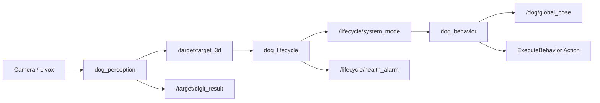

# Dog - 机器狗视觉与定位系统

## 1. 项目简介
Dog 是一个基于 ROS 2 Humble 的机器狗感知与行为协同项目，目标运行平台为 Ubuntu 22.04 + NUC。
系统负责将相机和激光雷达输入转换为可执行的目标位姿、行为指令与生命周期控制信号，并通过 ROS 通信与运动控制模块协作。

## 2. 技术栈
- OS: Ubuntu 22.04
- 中间件: ROS 2 Humble
- 语言: C++
- 构建系统: `ament_cmake` + `colcon`

## 3. 快速开始

### 3.1 依赖准备
- ROS 2 Humble
- GCC / CMake
- 常用依赖（至少）：`ros-humble-vision-msgs`

```bash
sudo apt update
sudo apt install -y ros-humble-vision-msgs
```

### 3.2 构建
```bash
source /opt/ros/humble/setup.bash
colcon build
source install/setup.bash
```

### 3.3 最小运行（按节点）
```bash
source /opt/ros/humble/setup.bash
source install/setup.bash

# 终端 1
ros2 run dog_perception dog_perception_node

# 终端 2
ros2 run dog_lifecycle dog_lifecycle_node

# 终端 3
ros2 run dog_behavior dog_behavior_node
```

### 3.4 推荐启动（Launch 一键拉起）
```bash
source /opt/ros/humble/setup.bash
source install/setup.bash
ros2 launch dog_behavior launch.py
```

- Launch 文件位置：`src/dog_behavior/launch/launch.py`
- 该命令会启动项目核心节点：`dog_perception_node`、`dog_lifecycle_node`、`dog_behavior_node`
- 该命令也会尝试启动第三方组件：`livox_ros_driver2`、`point_lio`
- 若第三方包未构建或未安装到当前 overlay，启动时会自动跳过并打印提示，不影响核心节点拉起

### 3.5 启动参数（统一入口）

可用参数如下：

- `use_livox`（默认：`true`）：是否启动 `livox_ros_driver2`
- `livox_model`（默认：`mid360`，可选：`mid360` / `hap`）：选择 Livox 启动配置
- `use_point_lio`（默认：`true`）：是否启动 `point_lio`
- `use_point_lio_rviz`（默认：`false`）：是否由 `point_lio` 同时拉起 RViz
- `use_perception_camera`（默认：`false`）：是否启动 `dog_perception_camera_node`

示例：

```bash
# 默认：核心节点 + 尝试启动第三方
ros2 launch dog_behavior launch.py

# 指定 HAP 配置
ros2 launch dog_behavior launch.py livox_model:=hap

# 打开 point_lio 的 RViz
ros2 launch dog_behavior launch.py use_point_lio_rviz:=true

# 同时启动相机发布节点
ros2 launch dog_behavior launch.py use_perception_camera:=true

# 仅启动项目核心节点（关闭第三方）
ros2 launch dog_behavior launch.py use_livox:=false use_point_lio:=false
```

### 3.6 第三方组件启用前提

若希望 `livox_ros_driver2` 和 `point_lio` 实际参与运行，需要先完成它们在当前工作区中的可构建与可发现（`ros2 pkg list` 可见）。

## 4. 仓库结构
```text
Dog/
├── src/
│   ├── dog_interfaces/   # 跨模块 msg/srv/action 定义
│   ├── dog_perception/   # 感知与 2D/3D 目标解算
│   ├── dog_behavior/     # 行为执行与 Action 客户端
│   └── dog_lifecycle/    # 生命周期、降级、重启与健康守护
├── 3rd_party/
│   ├── livox_ros_driver2/
│   └── point_lio/
├── docs/
├── _bmad-output/
├── build/ install/ log/
└── tools/
```

## 5. 核心包职责
- `dog_interfaces`：定义项目统一接口（消息、服务、Action）。
- `dog_perception`：处理图像/点云输入，发布目标识别与目标 3D 结果。
- `dog_behavior`：订阅定位/上下文信息，触发动作执行 Action 并发布行为相关状态。
- `dog_lifecycle`：实现状态持久化、健康监控、异常重试、熔断降级与系统模式广播。

## 6. 端到端数据流（简图）


## 7. 关键 Topic 与接口（当前实现）
- `dog_perception`：
  - 订阅：`/camera/image_raw`、`/livox/lidar`、`/lifecycle/system_mode`
  - 发布：`/target/target_3d`、`/target/digit_result`
- `dog_lifecycle`：
  - 订阅：`/behavior/grasp_feedback`、`/system/estop`、`/target/target_3d`
  - 发布：`/lifecycle/system_mode`、`/lifecycle/health_alarm`、`/lifecycle/degrade_command`
- `dog_behavior`：
  - 订阅：`/localization/dog`、`/lifecycle/recovery_context`、`/lifecycle/system_mode`
  - 发布：`/dog/global_pose`
  - Action 客户端：`/behavior/execute`

## 8. 开发与测试工作流

### 8.1 按包构建
```bash
colcon build --packages-select dog_interfaces dog_perception dog_lifecycle dog_behavior
source install/setup.bash
```

### 8.2 按包测试
```bash
colcon test --packages-select dog_perception
colcon test-result --all --verbose
```

### 8.3 全量测试
```bash
colcon test
colcon test-result --all --verbose
```

## 9. 常见问题与排障
- 构建目录路径变更后编译失败（CMakeCache 路径不一致）：
  - 现象：工作区从旧路径迁移后，`colcon build` 报 source path mismatch。
  - 处理：清理受影响包的 `build/<pkg>` 和 `install/<pkg>` 后重新构建。
- `vision_msgs` 缺失导致 `dog_perception` 无法构建：
  - 处理：`sudo apt install -y ros-humble-vision-msgs`
- gtest 修改后执行 `colcon test --ctest-args -R <name>` 显示未找到测试：
  - 处理：先执行 `colcon build --packages-select <pkg>` 以刷新测试注册。
- 心跳重连长时间 pending：
  - 建议确保 `reconnect_pending_timeout_ms < restart_window_ms`，避免重试计数无法有效累积。

## 10. 文档索引
- `docs/index.md`：文档总览
- `docs/project-overview.md`：项目概览
- `docs/architecture.md`：系统架构与设计
- `docs/integration-architecture.md`：系统集成说明
- `docs/interface-architecture.md`：接口架构草案
- `docs/development-instructions.md`：开发与部署说明

## 11. BMAD 产物
- `_bmad-output/planning-artifacts/`：规划阶段产物（PRD、架构、故事等）
- `_bmad-output/implementation-artifacts/`：实现阶段产物（冲刺状态、实现记录等）

## 12. 备注
- `build/`、`install/`、`log/` 为本地构建产物，不建议手工编辑。
- `3rd_party/` 下组件请分别参考各自 README 进行配置。
