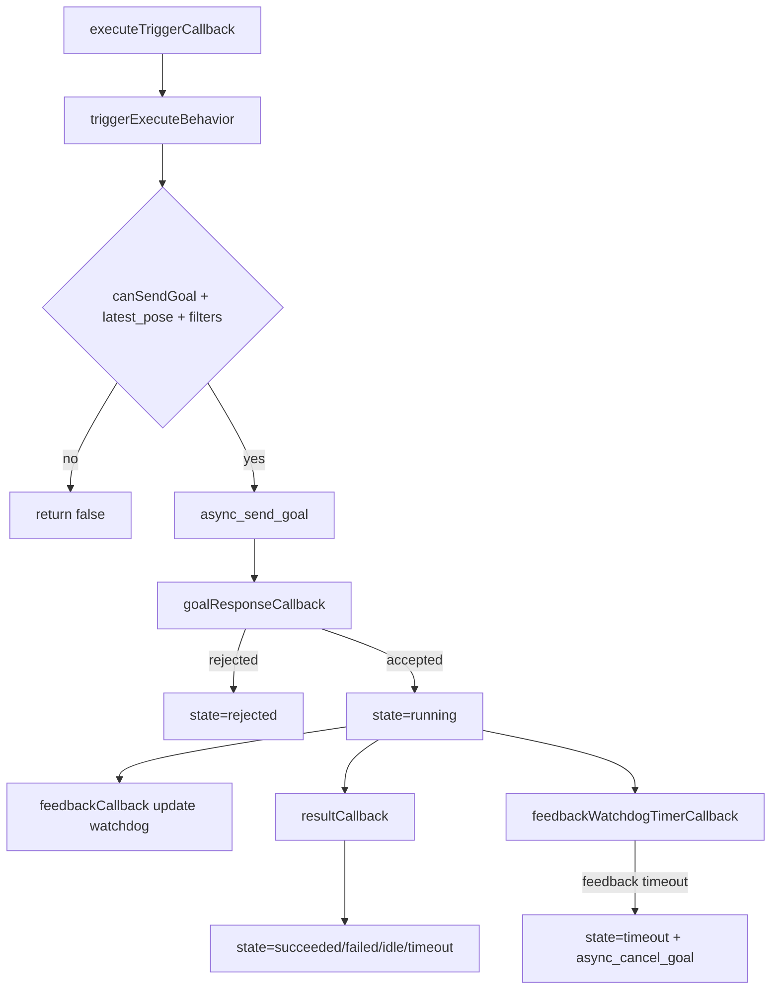

# dog_behavior AI 开发查询文档

本文档面向 AI 辅助开发与代码检索，聚焦以下目标：

1. 快速定位行为节点函数调用链。
2. 明确跨包接口（Topic、Action、参数、字符串协议）。
3. 提供可直接跳转的源码锚点与测试契约。

## 1. 包定位与组成

包路径：[src/dog_behavior](../src/dog_behavior)

核心文件：

1. 节点头文件：[src/dog_behavior/include/dog_behavior/behavior_node.hpp](../src/dog_behavior/include/dog_behavior/behavior_node.hpp)
2. 节点实现：[src/dog_behavior/src/behavior_node.cpp](../src/dog_behavior/src/behavior_node.cpp)
3. 进程入口：[src/dog_behavior/src/main.cpp](../src/dog_behavior/src/main.cpp)
4. 启动编排：[src/dog_behavior/launch/launch.py](../src/dog_behavior/launch/launch.py)
5. 节点测试：[src/dog_behavior/test/test_behavior_node.cpp](../src/dog_behavior/test/test_behavior_node.cpp)
6. 构建入口：[src/dog_behavior/CMakeLists.txt](../src/dog_behavior/CMakeLists.txt)
7. 包依赖声明：[src/dog_behavior/package.xml](../src/dog_behavior/package.xml)
8. 动作定义：[src/dog_interfaces/action/ExecuteBehavior.action](../src/dog_interfaces/action/ExecuteBehavior.action)

## 2. 运行时职责概览

BehaviorNode 在运行时承担四条主线：

1. 里程计转全局位姿：订阅 odom，校验后发布 PoseStamped，并缓存 latest_pose。
2. 行为触发分发：订阅字符串触发，封装 ExecuteBehavior Goal 并发送到 action server。
3. 恢复上下文过滤：根据 lifecycle 发布的 recovered/cold_start 上下文决定是否阻断某 task_phase 的再次执行。
4. 系统模式联动：在 idle_spinning 或 degraded 模式下阻断新目标，并可取消当前活动目标。

## 3. 函数调用结构（可检索）

### 3.1 启动与初始化链

入口链路：

1. main 创建节点并 spin：[src/dog_behavior/src/main.cpp#L4](../src/dog_behavior/src/main.cpp#L4)
2. 默认构造委托到 options 构造：[src/dog_behavior/src/behavior_node.cpp#L62](../src/dog_behavior/src/behavior_node.cpp#L62)
3. 主构造函数声明参数并初始化 pub/sub/action/timer：[src/dog_behavior/src/behavior_node.cpp#L67](../src/dog_behavior/src/behavior_node.cpp#L67)
4. 初始状态置为 waiting_server，等待动作服务就绪：[src/dog_behavior/src/behavior_node.cpp#L151](../src/dog_behavior/src/behavior_node.cpp#L151)
5. `actionServerWaitTimerCallback` 周期探测服务端：[src/dog_behavior/src/behavior_node.cpp#L323](../src/dog_behavior/src/behavior_node.cpp#L323)

```mermaid
flowchart TD
  A[main] --> B[BehaviorNode::BehaviorNode(options)]
  B --> C[declare_parameter + init pub/sub/action client]
  C --> D[state=waiting_server]
  D --> E[actionServerWaitTimerCallback]
  E -->|server ready| F[state=idle]
  E -->|timeout| G[state=server_unavailable]
```

### 3.2 位姿处理链（Odometry -> PoseStamped）

关键入口：

1. 订阅回调入口：[src/dog_behavior/src/behavior_node.cpp#L172](../src/dog_behavior/src/behavior_node.cpp#L172)
2. 有效值校验：`isFinitePose`：[src/dog_behavior/src/behavior_node.cpp#L658](../src/dog_behavior/src/behavior_node.cpp#L658)
3. 四元数范数校验：`hasValidQuaternionNorm`：[src/dog_behavior/src/behavior_node.cpp#L669](../src/dog_behavior/src/behavior_node.cpp#L669)
4. 缓存 latest_pose 并发布 global_pose：[src/dog_behavior/src/behavior_node.cpp#L222](../src/dog_behavior/src/behavior_node.cpp#L222)

处理规则：

1. 输入 frame_id 为空时，优先回退到 `default_frame_id`；若仍为空则丢弃。
2. 出现 NaN/Inf 或无效四元数范数时丢弃。
3. 仅通过校验的数据会更新 `latest_pose_`，供动作目标复用。

### 3.3 行为触发到 Action 结果链

关键入口：

1. 触发 topic 回调：[src/dog_behavior/src/behavior_node.cpp#L231](../src/dog_behavior/src/behavior_node.cpp#L231)
2. 触发核心方法：`triggerExecuteBehavior`：[src/dog_behavior/src/behavior_node.cpp#L386](../src/dog_behavior/src/behavior_node.cpp#L386)
3. 目标响应回调：`goalResponseCallback`：[src/dog_behavior/src/behavior_node.cpp#L450](../src/dog_behavior/src/behavior_node.cpp#L450)
4. 反馈回调：`feedbackCallback`：[src/dog_behavior/src/behavior_node.cpp#L469](../src/dog_behavior/src/behavior_node.cpp#L469)
5. 结果回调：`resultCallback`：[src/dog_behavior/src/behavior_node.cpp#L486](../src/dog_behavior/src/behavior_node.cpp#L486)
6. 看门狗超时：`feedbackWatchdogTimerCallback`：[src/dog_behavior/src/behavior_node.cpp#L354](../src/dog_behavior/src/behavior_node.cpp#L354)

前置条件（发送 goal 前）：

1. 不能处于 idle_spinning/degraded 模式。
2. 不能命中 recovered completed task_phase 阻断集合。
3. action server 必须 ready，且不存在 pending/active goal。
4. 必须已有 `latest_pose_`。



### 3.4 恢复上下文过滤链

关键入口：

1. 回调入口：`recoveryContextCallback`：[src/dog_behavior/src/behavior_node.cpp#L242](../src/dog_behavior/src/behavior_node.cpp#L242)
2. 负载解析：`parseKeyValuePayload`：[src/dog_behavior/src/behavior_node.cpp#L626](../src/dog_behavior/src/behavior_node.cpp#L626)
3. 完成态判断：`isCompletedState`：[src/dog_behavior/src/behavior_node.cpp#L652](../src/dog_behavior/src/behavior_node.cpp#L652)

规则：

1. `mode=cold_start`：清空已恢复完成集合。
2. `mode=recovered` 且 `task_phase` 非空：
   1. 若 `target_state` 是完成态（done/completed/succeeded/success/finished），加入阻断集合。
   2. 否则从阻断集合移除（允许继续执行）。
3. 未知 mode 或缺少关键字段时仅记录告警，不改变执行流程。

### 3.5 系统模式链（idle_spinning/degraded）

关键入口：

1. 回调入口：`systemModeCallback`：[src/dog_behavior/src/behavior_node.cpp#L282](../src/dog_behavior/src/behavior_node.cpp#L282)
2. 模式更新后取消活动目标：`async_cancel_goal`：[src/dog_behavior/src/behavior_node.cpp#L313](../src/dog_behavior/src/behavior_node.cpp#L313)
3. 测试可见状态：`IsIdleSpinningForTest`：[src/dog_behavior/src/behavior_node.cpp#L575](../src/dog_behavior/src/behavior_node.cpp#L575)

规则：

1. `mode=idle_spinning` 或 `mode=degraded` 视为禁止执行模式。
2. 若切入禁止模式且当前有 active goal，会主动取消并回到 idle。
3. 退出禁止模式后可重新接收目标。

## 4. 外部接口字典

### 4.1 订阅接口

1. `localization_topic`，默认 `/localization/dog`，类型 `nav_msgs/msg/Odometry`，QoS SensorData keep_last(20)：[src/dog_behavior/src/behavior_node.cpp#L78](../src/dog_behavior/src/behavior_node.cpp#L78)
2. `execute_behavior_trigger_topic`，默认 `/behavior/execute_trigger`，类型 `std_msgs/msg/String`，QoS Reliable keep_last(10)：[src/dog_behavior/src/behavior_node.cpp#L84](../src/dog_behavior/src/behavior_node.cpp#L84)
3. `recovery_context_topic`，默认 `/lifecycle/recovery_context`，类型 `std_msgs/msg/String`，QoS Reliable + TransientLocal keep_last(1)：[src/dog_behavior/src/behavior_node.cpp#L87](../src/dog_behavior/src/behavior_node.cpp#L87)
4. `system_mode_topic`，默认 `/lifecycle/system_mode`，类型 `std_msgs/msg/String`，QoS Reliable + TransientLocal keep_last(1)：[src/dog_behavior/src/behavior_node.cpp#L90](../src/dog_behavior/src/behavior_node.cpp#L90)

### 4.2 发布接口

1. `global_pose_topic`，默认 `/dog/global_pose`，类型 `geometry_msgs/msg/PoseStamped`，QoS Reliable keep_last(20)：[src/dog_behavior/src/behavior_node.cpp#L77](../src/dog_behavior/src/behavior_node.cpp#L77)

### 4.3 Action 客户端接口

1. Action 名称参数 `execute_behavior_action_name`，默认 `/behavior/execute`：[src/dog_behavior/src/behavior_node.cpp#L80](../src/dog_behavior/src/behavior_node.cpp#L80)
2. Action 类型 `dog_interfaces/action/ExecuteBehavior`：[src/dog_interfaces/action/ExecuteBehavior.action](../src/dog_interfaces/action/ExecuteBehavior.action)
3. Goal 字段：`behavior_name`、`target_pose`
4. Result 字段：`accepted`、`detail`
5. Feedback 字段：`progress`、`state`

### 4.4 字符串负载协议（关键字段）

1. 执行触发消息（`/behavior/execute_trigger`）：`msg.data` 直接作为 `behavior_name`。
2. 恢复上下文（`/lifecycle/recovery_context`）：`mode=...;task_phase=...;target_state=...;...`
3. 系统模式（`/lifecycle/system_mode`）：至少包含 `mode=normal|idle_spinning|degraded`。
4. 解析特性：键名标准化为小写去空白；值支持 `%xx` 百分号解码：[src/dog_behavior/src/behavior_node.cpp#L626](../src/dog_behavior/src/behavior_node.cpp#L626)

## 5. 参数清单与默认值

参数声明位置：[src/dog_behavior/src/behavior_node.cpp#L77](../src/dog_behavior/src/behavior_node.cpp#L77)

1. `global_pose_topic`，默认 `/dog/global_pose`
2. `localization_topic`，默认 `/localization/dog`
3. `default_frame_id`，默认 `base_link`
4. `execute_behavior_action_name`，默认 `/behavior/execute`
5. `execute_behavior_trigger_topic`，默认 `/behavior/execute_trigger`
6. `recovery_context_topic`，默认 `/lifecycle/recovery_context`
7. `system_mode_topic`，默认 `/lifecycle/system_mode`
8. `action_server_wait_timeout_sec`，默认 `5.0`，无效值回退为 `5.0`：[src/dog_behavior/src/behavior_node.cpp#L94](../src/dog_behavior/src/behavior_node.cpp#L94)
9. `feedback_timeout_sec`，默认 `2.0`，无效值回退为 `2.0`：[src/dog_behavior/src/behavior_node.cpp#L102](../src/dog_behavior/src/behavior_node.cpp#L102)

## 6. 内部状态模型

状态枚举定义：[src/dog_behavior/include/dog_behavior/behavior_node.hpp#L45](../src/dog_behavior/include/dog_behavior/behavior_node.hpp#L45)

状态集合：

1. `idle`
2. `waiting_server`
3. `server_unavailable`
4. `sending_goal`
5. `running`
6. `succeeded`
7. `failed`
8. `rejected`
9. `timeout`

文本映射入口：[src/dog_behavior/src/behavior_node.cpp#L587](../src/dog_behavior/src/behavior_node.cpp#L587)

关键状态迁移：

1. 构造后 `waiting_server -> idle`（server ready）或 `waiting_server -> server_unavailable`（超时）。
2. 触发发送时 `idle -> sending_goal -> running`。
3. 结果回调导致 `running -> succeeded|failed|idle|timeout`。
4. watchdog 超时触发 `running -> timeout` 并取消目标。

## 7. 测试覆盖与行为契约

测试文件：[src/dog_behavior/test/test_behavior_node.cpp](../src/dog_behavior/test/test_behavior_node.cpp)

关键测试锚点：

1. 初始化参数与发布器存在性：[src/dog_behavior/test/test_behavior_node.cpp#L221](../src/dog_behavior/test/test_behavior_node.cpp#L221)
2. Odom 转 PoseStamped 正确性：[src/dog_behavior/test/test_behavior_node.cpp#L237](../src/dog_behavior/test/test_behavior_node.cpp#L237)
3. 发布抖动预算（<5ms）：[src/dog_behavior/test/test_behavior_node.cpp#L303](../src/dog_behavior/test/test_behavior_node.cpp#L303)
4. 空 frame_id 回退默认 frame：[src/dog_behavior/test/test_behavior_node.cpp#L389](../src/dog_behavior/test/test_behavior_node.cpp#L389)
5. 输入与默认 frame 都空时丢弃：[src/dog_behavior/test/test_behavior_node.cpp#L442](../src/dog_behavior/test/test_behavior_node.cpp#L442)
6. Action 成功路径（反馈+结果）：[src/dog_behavior/test/test_behavior_node.cpp#L493](../src/dog_behavior/test/test_behavior_node.cpp#L493)
7. Action 拒绝路径：[src/dog_behavior/test/test_behavior_node.cpp#L560](../src/dog_behavior/test/test_behavior_node.cpp#L560)
8. Action server 不可用路径：[src/dog_behavior/test/test_behavior_node.cpp#L620](../src/dog_behavior/test/test_behavior_node.cpp#L620)
9. watchdog 超时取消保持 timeout：[src/dog_behavior/test/test_behavior_node.cpp#L643](../src/dog_behavior/test/test_behavior_node.cpp#L643)
10. aborted 结果映射为 failed：[src/dog_behavior/test/test_behavior_node.cpp#L705](../src/dog_behavior/test/test_behavior_node.cpp#L705)
11. recovered 完成态触发任务阻断：[src/dog_behavior/test/test_behavior_node.cpp#L767](../src/dog_behavior/test/test_behavior_node.cpp#L767)
12. recovered 未完成态允许继续执行：[src/dog_behavior/test/test_behavior_node.cpp#L833](../src/dog_behavior/test/test_behavior_node.cpp#L833)
13. idle_spinning 阻断新目标并恢复后可继续：[src/dog_behavior/test/test_behavior_node.cpp#L901](../src/dog_behavior/test/test_behavior_node.cpp#L901)

## 8. 构建与启动关联

1. 库目标 `${PROJECT_NAME}_lib`： [src/dog_behavior/CMakeLists.txt#L16](../src/dog_behavior/CMakeLists.txt#L16)
2. 节点可执行 `${PROJECT_NAME}_node`： [src/dog_behavior/CMakeLists.txt#L32](../src/dog_behavior/CMakeLists.txt#L32)
3. gtest 入口： [src/dog_behavior/CMakeLists.txt#L53](../src/dog_behavior/CMakeLists.txt#L53)
4. 依赖声明（rclcpp/rclcpp_action/nav_msgs/geometry_msgs/std_msgs/dog_interfaces）： [src/dog_behavior/package.xml#L11](../src/dog_behavior/package.xml#L11)
5. 系统一体化 launch 入口： [src/dog_behavior/launch/launch.py#L47](../src/dog_behavior/launch/launch.py#L47)

## 9. AI 查询建议（可直接复用）

可用于代码检索/问答的查询短语：

1. dog_behavior triggerExecuteBehavior preconditions latest_pose action_server_ready
2. behavior_node recoveryContextCallback completed task phase filtering
3. behavior_node systemModeCallback idle_spinning cancel active goal
4. behavior_node feedbackWatchdogTimerCallback timeout cancel semantics
5. ExecuteBehavior action fields behavior_name target_pose accepted detail progress state

可用于变更影响分析的入口函数：

1. [src/dog_behavior/src/behavior_node.cpp#L386](../src/dog_behavior/src/behavior_node.cpp#L386)
2. [src/dog_behavior/src/behavior_node.cpp#L242](../src/dog_behavior/src/behavior_node.cpp#L242)
3. [src/dog_behavior/src/behavior_node.cpp#L282](../src/dog_behavior/src/behavior_node.cpp#L282)
4. [src/dog_behavior/src/behavior_node.cpp#L354](../src/dog_behavior/src/behavior_node.cpp#L354)
5. [src/dog_behavior/src/behavior_node.cpp#L486](../src/dog_behavior/src/behavior_node.cpp#L486)

## 10. 维护建议

1. 修改 recovery/system mode 字符串协议时，同步更新 `parseKeyValuePayload` 相关测试场景。
2. 修改 goal 生命周期或超时逻辑时，优先回归 timeout/rejected/aborted 三组测试。
3. 修改 pose 校验逻辑时，回归 frame fallback 与丢弃路径测试，避免误发布无效位姿。