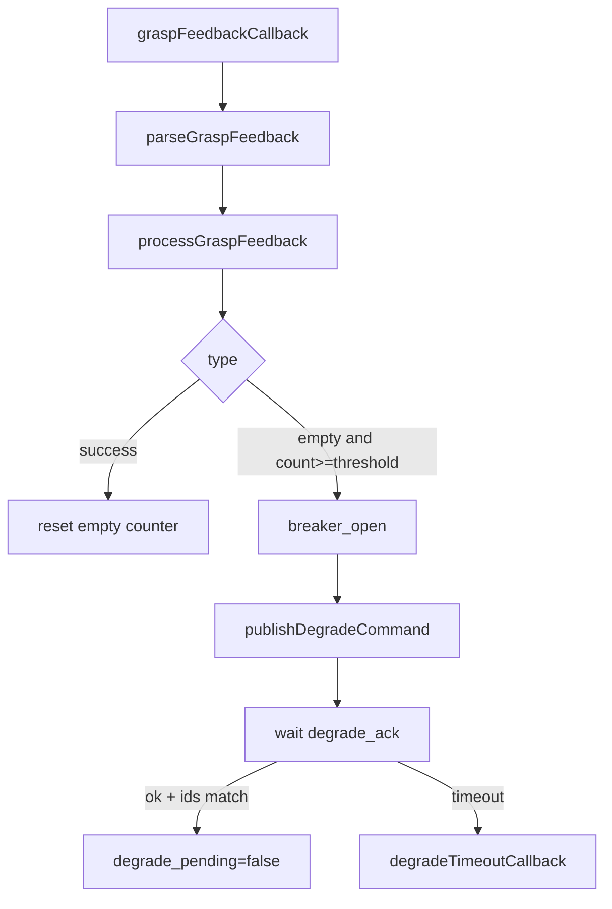
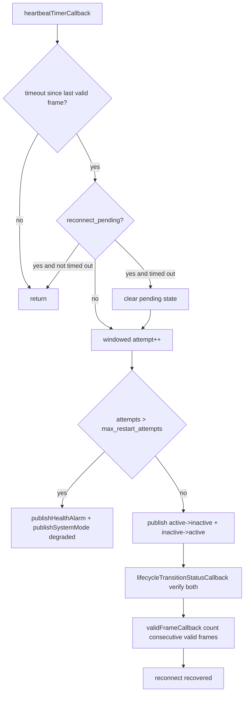

# dog_lifecycle AI 开发查询文档

本文档面向 AI 辅助开发与代码检索，聚焦以下目标：

1. 快速定位函数调用链路。
2. 明确外部接口（Topic、参数、持久化格式）。
3. 提供可直接跳转的源码锚点。

## 1. 包定位与组成

包路径：[src/dog_lifecycle](../src/dog_lifecycle)

核心文件：

1. 节点头文件：[src/dog_lifecycle/include/dog_lifecycle/lifecycle_node.hpp](../src/dog_lifecycle/include/dog_lifecycle/lifecycle_node.hpp)
2. 节点实现：[src/dog_lifecycle/src/lifecycle_node.cpp](../src/dog_lifecycle/src/lifecycle_node.cpp)
3. 持久化接口：[src/dog_lifecycle/include/dog_lifecycle/state_store.hpp](../src/dog_lifecycle/include/dog_lifecycle/state_store.hpp)
4. YAML 状态存储实现：[src/dog_lifecycle/src/yaml_state_store.cpp](../src/dog_lifecycle/src/yaml_state_store.cpp)
5. 进程入口：[src/dog_lifecycle/src/main.cpp](../src/dog_lifecycle/src/main.cpp)
6. 参数样例：[src/dog_lifecycle/config/persistence.yaml](../src/dog_lifecycle/config/persistence.yaml)
7. 节点测试：[src/dog_lifecycle/test/test_lifecycle_node.cpp](../src/dog_lifecycle/test/test_lifecycle_node.cpp)
8. 存储测试：[src/dog_lifecycle/test/test_yaml_state_store.cpp](../src/dog_lifecycle/test/test_yaml_state_store.cpp)

构建入口：

1. [src/dog_lifecycle/CMakeLists.txt](../src/dog_lifecycle/CMakeLists.txt)
2. [src/dog_lifecycle/package.xml](../src/dog_lifecycle/package.xml)

## 2. 运行时职责概览

LifecycleNode 在运行时承担四条主线：

1. 抓取反馈熔断：连续空抓触发降级命令。
2. 心跳守护与重连：感知帧超时触发生命周期重启尝试；超过窗口上限进入受控降级。
3. 急停模式切换：estop 信号驱动 system mode 在 normal 与 idle_spinning 间切换。
4. 启停持久化：启动加载恢复上下文，析构清理持久化文件。

## 3. 函数调用结构（可检索）

### 3.1 启动与初始化链

入口链路：

1. main 调用构造与 spin：[src/dog_lifecycle/src/main.cpp#L4](../src/dog_lifecycle/src/main.cpp#L4)
2. 默认构造转发到带 options 构造：[src/dog_lifecycle/src/lifecycle_node.cpp#L48](../src/dog_lifecycle/src/lifecycle_node.cpp#L48)
3. 主构造函数执行参数声明、校验、发布器/订阅器/定时器初始化：[src/dog_lifecycle/src/lifecycle_node.cpp#L53](../src/dog_lifecycle/src/lifecycle_node.cpp#L53)
4. 构造阶段读取状态并发布 recovery context：[src/dog_lifecycle/src/lifecycle_node.cpp#L250](../src/dog_lifecycle/src/lifecycle_node.cpp#L250)
5. 启动默认系统模式 normal：[src/dog_lifecycle/src/lifecycle_node.cpp#L306](../src/dog_lifecycle/src/lifecycle_node.cpp#L306)

```mermaid
flowchart TD
  A[main] --> B[LifecycleNode::LifecycleNode(options)]
  B --> C[declare_parameter + validate]
  C --> D[create publishers/subscribers/timer]
  D --> E[state_store.Load]
  E --> F[publishRecoveryContext]
  F --> G[publishSystemMode normal]
```

### 3.2 抓取反馈到降级链

关键入口：

1. 订阅回调入口：[src/dog_lifecycle/src/lifecycle_node.cpp#L461](../src/dog_lifecycle/src/lifecycle_node.cpp#L461)
2. 解析反馈：[src/dog_lifecycle/src/lifecycle_node.cpp#L614](../src/dog_lifecycle/src/lifecycle_node.cpp#L614)
3. 熔断状态机处理：[src/dog_lifecycle/src/lifecycle_node.cpp#L654](../src/dog_lifecycle/src/lifecycle_node.cpp#L654)
4. 发布降级命令：[src/dog_lifecycle/src/lifecycle_node.cpp#L1005](../src/dog_lifecycle/src/lifecycle_node.cpp#L1005)
5. 降级确认回调：[src/dog_lifecycle/src/lifecycle_node.cpp#L467](../src/dog_lifecycle/src/lifecycle_node.cpp#L467)
6. 降级超时回调：[src/dog_lifecycle/src/lifecycle_node.cpp#L1092](../src/dog_lifecycle/src/lifecycle_node.cpp#L1092)

状态转移摘要：

1. success：清空连续空抓计数。
2. empty：同 task_id 连续计数，达到阈值后开启 breaker 并发 degrade。
3. exception：记录异常日志，不直接触发 degrade。
4. unknown：仅告警。

去重逻辑：在 feedback_dedup_window_ms 内，若 task_id 与 type 均相同，则忽略重复反馈。



### 3.3 心跳守护与重连链

关键入口：

1. 心跳定时器：[src/dog_lifecycle/src/lifecycle_node.cpp#L876](../src/dog_lifecycle/src/lifecycle_node.cpp#L876)
2. 有效帧回调：[src/dog_lifecycle/src/lifecycle_node.cpp#L764](../src/dog_lifecycle/src/lifecycle_node.cpp#L764)
3. 迁移状态回调：[src/dog_lifecycle/src/lifecycle_node.cpp#L805](../src/dog_lifecycle/src/lifecycle_node.cpp#L805)
4. 发布 lifecycle transition：[src/dog_lifecycle/src/lifecycle_node.cpp#L1134](../src/dog_lifecycle/src/lifecycle_node.cpp#L1134)
5. 发布健康告警：[src/dog_lifecycle/src/lifecycle_node.cpp#L1159](../src/dog_lifecycle/src/lifecycle_node.cpp#L1159)

重连关键规则：

1. 若无有效帧超过 heartbeat_timeout_ms，则进入重连判定。
2. reconnect_pending 为真时，不累计新 attempt，防止 attempt 膨胀。
3. pending 超时超过 reconnect_pending_timeout_ms 时，允许下一次重连尝试。
4. attempt 在 restart_window_ms 滑动窗口内计数。
5. attempts 大于 max_restart_attempts 时，进入 controlled_degrade_mode，并发 health alarm + degraded mode。
6. 重连恢复条件：先收到 inactive 与 active 两段迁移确认，再连续收到 valid_frame_recovery_consecutive 个有效帧。



### 3.4 急停模式链

关键入口：

1. estop 回调：[src/dog_lifecycle/src/lifecycle_node.cpp#L510](../src/dog_lifecycle/src/lifecycle_node.cpp#L510)
2. 解析 active/mode token：[src/dog_lifecycle/src/lifecycle_node.cpp#L571](../src/dog_lifecycle/src/lifecycle_node.cpp#L571)
3. 发布 system mode：[src/dog_lifecycle/src/lifecycle_node.cpp#L1115](../src/dog_lifecycle/src/lifecycle_node.cpp#L1115)

行为：

1. active=true 或 mode=estop/idle_spinning -> 发布 mode=idle_spinning。
2. active=false 或 mode=normal -> 发布 mode=normal。
3. 模式未变化时不重复发布。

### 3.5 持久化链

节点层接口：

1. PersistTransition：[src/dog_lifecycle/src/lifecycle_node.cpp#L328](../src/dog_lifecycle/src/lifecycle_node.cpp#L328)
2. ClearPersistentState：[src/dog_lifecycle/src/lifecycle_node.cpp#L361](../src/dog_lifecycle/src/lifecycle_node.cpp#L361)
3. publishRecoveryContext：[src/dog_lifecycle/src/lifecycle_node.cpp#L1047](../src/dog_lifecycle/src/lifecycle_node.cpp#L1047)

存储层接口：

1. Save：[src/dog_lifecycle/src/yaml_state_store.cpp#L82](../src/dog_lifecycle/src/yaml_state_store.cpp#L82)
2. Load：[src/dog_lifecycle/src/yaml_state_store.cpp#L127](../src/dog_lifecycle/src/yaml_state_store.cpp#L127)
3. Clear：[src/dog_lifecycle/src/yaml_state_store.cpp#L180](../src/dog_lifecycle/src/yaml_state_store.cpp#L180)
4. 原子写：[src/dog_lifecycle/src/yaml_state_store.cpp#L235](../src/dog_lifecycle/src/yaml_state_store.cpp#L235)
5. 解析文件：[src/dog_lifecycle/src/yaml_state_store.cpp#L322](../src/dog_lifecycle/src/yaml_state_store.cpp#L322)

Load 回退策略：

1. 主文件不存在且备份存在 -> 读备份并尝试修复主文件。
2. 主文件损坏且备份可读 -> 使用备份并尝试修复主文件。
3. 主备都不可读 -> 返回 ParseError/ValidationError 路径。

## 4. 外部接口字典

### 4.1 订阅接口

1. grasp_feedback_topic，默认 /behavior/grasp_feedback，类型 std_msgs/String，QoS Reliable KeepLast(10)。
2. degrade_ack_topic，默认 /lifecycle/degrade_ack，类型 std_msgs/String，QoS Reliable KeepLast(10)。
3. estop_topic，默认 /system/estop，类型 std_msgs/String，QoS Reliable KeepLast(10)。
4. valid_frame_topic，默认 /perception/target3d，类型 dog_interfaces/msg/Target3DArray，QoS SensorData。
5. lifecycle_transition_status_topic，默认 /lifecycle/transition_status，类型 std_msgs/String，QoS Reliable KeepLast(10)。

### 4.2 发布接口

1. degrade_command_topic，默认 /lifecycle/degrade_command，类型 std_msgs/String，QoS Reliable KeepLast(10)。
2. recovery_context_topic，默认 /lifecycle/recovery_context，类型 std_msgs/String，QoS Reliable + TransientLocal KeepLast(1)。
3. system_mode_topic，默认 /lifecycle/system_mode，类型 std_msgs/String，QoS Reliable + TransientLocal KeepLast(1)。
4. lifecycle_transition_topic，默认 /lifecycle/transition_command，类型 std_msgs/String，QoS Reliable KeepLast(10)。
5. health_alarm_topic，默认 /lifecycle/health_alarm，类型 std_msgs/String，QoS Reliable KeepLast(10)。

### 4.3 字符串负载协议（关键字段）

1. degrade_command: task_id=...;mode=deliver_completed_boxes;reason=...;request_id=...
2. degrade_ack: task_id=...;status=ok|success;request_id=...
3. lifecycle_transition_command: node=...;from=active|inactive;to=inactive|active;reason=...;attempt=...
4. lifecycle_transition_status: node=...;from=...;to=...;status=ok|success|succeeded|done|completed;attempt=...
5. system_mode: mode=normal|idle_spinning|degraded;reason=...
6. health_alarm: type=heartbeat_restart_limit;reason=...;attempts=...;max_attempts=...;restart_window_ms=...
7. recovery_context:
   1. recovered: mode=recovered;task_phase=...;target_state=...;timestamp_ms=...;version=...;load_ms=...;map_ms=...;total_ms=...
   2. cold_start: mode=cold_start;task_phase=;target_state=;timestamp_ms=0;version=...;reason=...;load_ms=...;map_ms=...;total_ms=...

说明：键值解析通过 parseKeyValuePayload，键和值会统一小写并去空白处理，分隔符为分号。

## 5. 参数清单与默认值

参数声明与校验位置：[src/dog_lifecycle/src/lifecycle_node.cpp#L57](../src/dog_lifecycle/src/lifecycle_node.cpp#L57)

核心参数：

1. 熔断参数：empty_grasp_threshold，degrade_timeout_ms，breaker_reset_window_ms，feedback_dedup_window_ms。
2. 心跳参数：heartbeat_timeout_ms，heartbeat_check_period_ms，reconnect_min_interval_ms，reconnect_pending_timeout_ms，max_restart_attempts，restart_window_ms，valid_frame_recovery_consecutive。
3. 持久化参数：persistence.state_file_path，persistence.backup_file_path，persistence.max_write_bytes，persistence.min_write_interval_ms，persistence.state_version。
4. Topic 参数：见 4.1 和 4.2。

重要约束：

1. reconnect_pending_timeout_ms 小于等于 0 时会自适应计算，并被限制在 restart_window_ms 以内，保证 attempt 能在窗口内累积触发降级。
2. max_restart_attempts、restart_window_ms、heartbeat_timeout_ms 等无效值会回退到安全默认值。

样例配置文件：[src/dog_lifecycle/config/persistence.yaml](../src/dog_lifecycle/config/persistence.yaml)

## 6. 持久化数据模型

接口定义：[src/dog_lifecycle/include/dog_lifecycle/state_store.hpp](../src/dog_lifecycle/include/dog_lifecycle/state_store.hpp)

RecoverableState 字段：

1. task_phase
2. timestamp_ms
3. target_state
4. version

错误码枚举 StateStoreError：

1. None
2. FileNotFound
3. ParseError
4. ValidationError
5. VersionMismatch
6. IOError
7. RateLimited
8. PayloadTooLarge

YAML 文件键：task_phase, timestamp_ms, target_state, version。

## 7. 测试覆盖与行为契约

### 7.1 LifecycleNode 行为测试

测试文件：[src/dog_lifecycle/test/test_lifecycle_node.cpp](../src/dog_lifecycle/test/test_lifecycle_node.cpp)

关键测试锚点：

1. 熔断开启与任务阻断：[src/dog_lifecycle/test/test_lifecycle_node.cpp#L105](../src/dog_lifecycle/test/test_lifecycle_node.cpp#L105)
2. breaker->degrade 时延小于 1 秒：[src/dog_lifecycle/test/test_lifecycle_node.cpp#L162](../src/dog_lifecycle/test/test_lifecycle_node.cpp#L162)
3. 重置窗口避免误触发：[src/dog_lifecycle/test/test_lifecycle_node.cpp#L201](../src/dog_lifecycle/test/test_lifecycle_node.cpp#L201)
4. estop 模式切换：[src/dog_lifecycle/test/test_lifecycle_node.cpp#L252](../src/dog_lifecycle/test/test_lifecycle_node.cpp#L252)
5. 心跳超时触发重连：[src/dog_lifecycle/test/test_lifecycle_node.cpp#L307](../src/dog_lifecycle/test/test_lifecycle_node.cpp#L307)
6. 重连恢复时延小于 2 秒：[src/dog_lifecycle/test/test_lifecycle_node.cpp#L362](../src/dog_lifecycle/test/test_lifecycle_node.cpp#L362)
7. 达到重启上限触发受控降级与告警：[src/dog_lifecycle/test/test_lifecycle_node.cpp#L458](../src/dog_lifecycle/test/test_lifecycle_node.cpp#L458)
8. pending 期间 attempt 不膨胀：[src/dog_lifecycle/test/test_lifecycle_node.cpp#L531](../src/dog_lifecycle/test/test_lifecycle_node.cpp#L531)
9. 小窗口自适应 pending timeout 可触发降级：[src/dog_lifecycle/test/test_lifecycle_node.cpp#L586](../src/dog_lifecycle/test/test_lifecycle_node.cpp#L586)
10. degrade 状态下 estop 仍生效：[src/dog_lifecycle/test/test_lifecycle_node.cpp#L646](../src/dog_lifecycle/test/test_lifecycle_node.cpp#L646)
11. 边界条件 attempts==max 允许该次尝试：[src/dog_lifecycle/test/test_lifecycle_node.cpp#L734](../src/dog_lifecycle/test/test_lifecycle_node.cpp#L734)
12. 启动恢复上下文路径（recovered/cold_start/双损坏）：[src/dog_lifecycle/test/test_lifecycle_node.cpp#L786](../src/dog_lifecycle/test/test_lifecycle_node.cpp#L786)

### 7.2 YamlStateStore 行为测试

测试文件：[src/dog_lifecycle/test/test_yaml_state_store.cpp](../src/dog_lifecycle/test/test_yaml_state_store.cpp)

关键测试锚点：

1. Save+Load 成功路径：[src/dog_lifecycle/test/test_yaml_state_store.cpp#L66](../src/dog_lifecycle/test/test_yaml_state_store.cpp#L66)
2. 主文件损坏回退备份：[src/dog_lifecycle/test/test_yaml_state_store.cpp#L91](../src/dog_lifecycle/test/test_yaml_state_store.cpp#L91)
3. 版本不匹配错误：[src/dog_lifecycle/test/test_yaml_state_store.cpp#L105](../src/dog_lifecycle/test/test_yaml_state_store.cpp#L105)
4. 并发保存受保护：[src/dog_lifecycle/test/test_yaml_state_store.cpp#L112](../src/dog_lifecycle/test/test_yaml_state_store.cpp#L112)
5. 备份失败不影响主写入：[src/dog_lifecycle/test/test_yaml_state_store.cpp#L153](../src/dog_lifecycle/test/test_yaml_state_store.cpp#L153)
6. 清理语义：[src/dog_lifecycle/test/test_yaml_state_store.cpp#L174](../src/dog_lifecycle/test/test_yaml_state_store.cpp#L174)
7. 写入性能预算（P95<100ms）：[src/dog_lifecycle/test/test_yaml_state_store.cpp#L185](../src/dog_lifecycle/test/test_yaml_state_store.cpp#L185)

## 8. AI 查询建议（可直接复用）

可用于代码检索/问答的查询短语：

1. dog_lifecycle heartbeat reconnect state machine
2. processGraspFeedback breaker_open degrade_pending relationship
3. lifecycle_transition_status attempt matching logic
4. reconnect_pending_timeout restart_window interaction
5. recovery_context payload format recovered cold_start
6. YamlStateStore backup fallback and atomic write

可用于变更影响分析的函数入口：

1. [src/dog_lifecycle/src/lifecycle_node.cpp#L876](../src/dog_lifecycle/src/lifecycle_node.cpp#L876)
2. [src/dog_lifecycle/src/lifecycle_node.cpp#L654](../src/dog_lifecycle/src/lifecycle_node.cpp#L654)
3. [src/dog_lifecycle/src/lifecycle_node.cpp#L764](../src/dog_lifecycle/src/lifecycle_node.cpp#L764)
4. [src/dog_lifecycle/src/lifecycle_node.cpp#L805](../src/dog_lifecycle/src/lifecycle_node.cpp#L805)
5. [src/dog_lifecycle/src/yaml_state_store.cpp#L127](../src/dog_lifecycle/src/yaml_state_store.cpp#L127)

## 9. 维护建议

1. 修改字符串协议字段时，同步更新 parseDegradeAck、parseKeyValuePayload 相关测试。
2. 修改重连窗口逻辑时，优先回归以下测试：L531、L586、L734。
3. 增加新 gtest 后，先对包执行构建，再执行过滤测试，避免 colcon 缓存导致找不到新测试。
