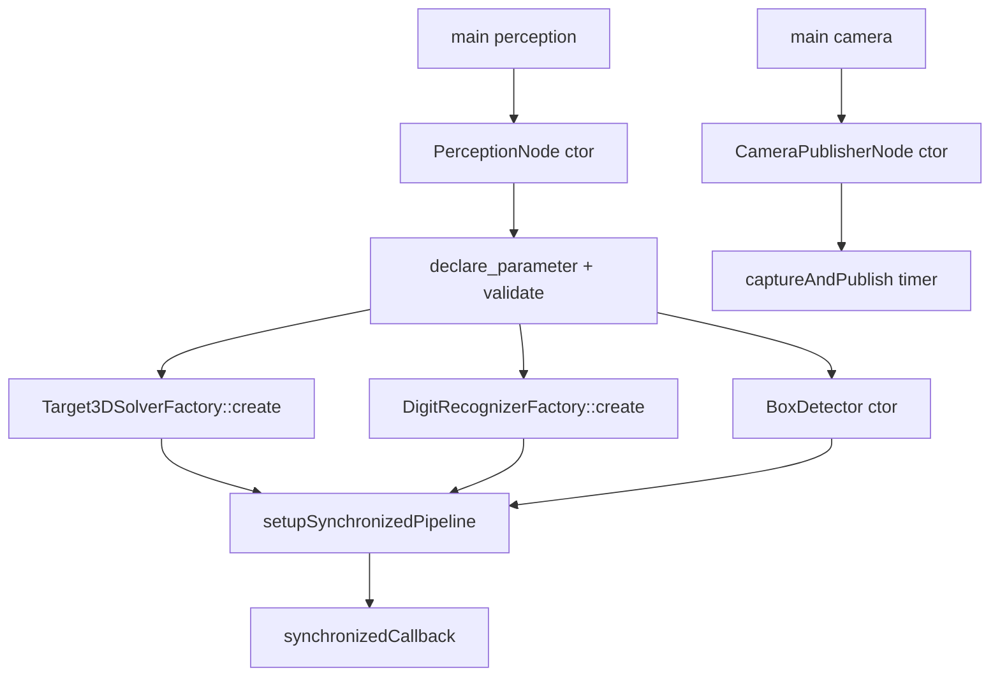
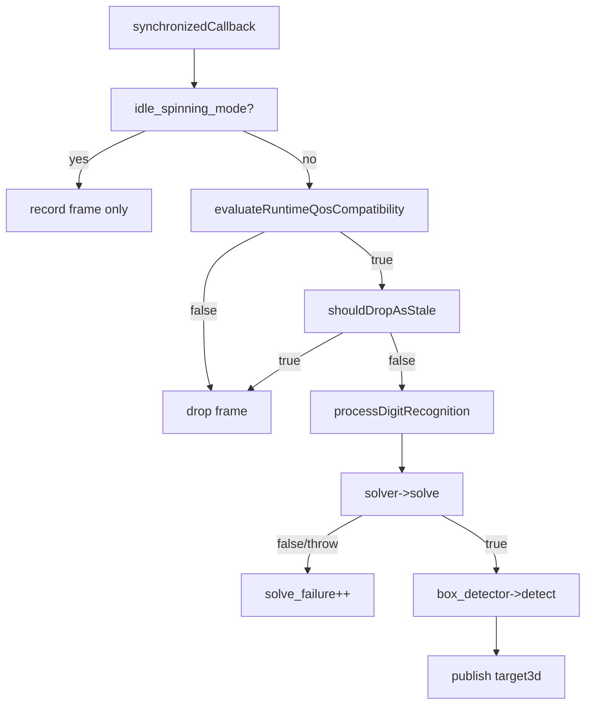

# dog_perception AI 开发查询文档

本文档面向 AI 辅助开发与代码检索，聚焦以下目标：

1. 快速定位感知链路中的函数调用结构。
2. 明确对外接口（Topic、消息、参数、字符串协议）。
3. 给出可直接跳转的源码锚点与测试契约。

## 1. 包定位与组成

包路径：[src/dog_perception](../src/dog_perception)

核心文件：

1. 感知节点头文件：[src/dog_perception/include/dog_perception/perception_node.hpp](../src/dog_perception/include/dog_perception/perception_node.hpp)
2. 感知节点实现：[src/dog_perception/src/perception_node.cpp](../src/dog_perception/src/perception_node.cpp)
3. 相机节点头文件：[src/dog_perception/include/dog_perception/camera_publisher_node.hpp](../src/dog_perception/include/dog_perception/camera_publisher_node.hpp)
4. 相机节点实现：[src/dog_perception/src/camera_publisher_node.cpp](../src/dog_perception/src/camera_publisher_node.cpp)
5. 3D 求解器接口：[src/dog_perception/include/dog_perception/target_3d_solver.hpp](../src/dog_perception/include/dog_perception/target_3d_solver.hpp)
6. 3D 求解器工厂与实现：[src/dog_perception/src/target_3d_solver_factory.cpp](../src/dog_perception/src/target_3d_solver_factory.cpp)
7. 数字识别器接口：[src/dog_perception/include/dog_perception/digit_recognizer.hpp](../src/dog_perception/include/dog_perception/digit_recognizer.hpp)
8. 数字识别器工厂：[src/dog_perception/src/digit_recognizer_factory.cpp](../src/dog_perception/src/digit_recognizer_factory.cpp)
9. 检测器实现目录：[src/dog_perception/src/detectors](../src/dog_perception/src/detectors)
10. 箱体检测器头文件：[src/dog_perception/include/dog_perception/box_detector.hpp](../src/dog_perception/include/dog_perception/box_detector.hpp)
11. 箱体检测器实现：[src/dog_perception/src/detectors/box_detector.cpp](../src/dog_perception/src/detectors/box_detector.cpp)
12. 进程入口（感知）：[src/dog_perception/src/main.cpp](../src/dog_perception/src/main.cpp)
13. 进程入口（相机）：[src/dog_perception/src/camera_main.cpp](../src/dog_perception/src/camera_main.cpp)
14. 参数样例（数字识别）：[src/dog_perception/config/digit_recognition.yaml](../src/dog_perception/config/digit_recognition.yaml)
15. 参数样例（箱体识别）：[src/dog_perception/config/box_recognition.yaml](../src/dog_perception/config/box_recognition.yaml)
16. 外参样例：[src/dog_perception/config/camera_extrinsics.yaml](../src/dog_perception/config/camera_extrinsics.yaml)
17. 节点测试：[src/dog_perception/test/test_perception_node.cpp](../src/dog_perception/test/test_perception_node.cpp)
18. 工厂测试：[src/dog_perception/test/test_digit_recognizer_factory.cpp](../src/dog_perception/test/test_digit_recognizer_factory.cpp)
19. 相机测试：[src/dog_perception/test/test_camera_publisher_node.cpp](../src/dog_perception/test/test_camera_publisher_node.cpp)
20. 箱体测试：[src/dog_perception/test/test_box_detector.cpp](../src/dog_perception/test/test_box_detector.cpp)
21. 构建入口：[src/dog_perception/CMakeLists.txt](../src/dog_perception/CMakeLists.txt)
22. 包依赖声明：[src/dog_perception/package.xml](../src/dog_perception/package.xml)

## 2. 运行时职责概览

PerceptionNode 运行时主线：

1. 同步图像与点云，驱动 3D 目标求解并发布 Target3DArray。
2. 同时执行数字识别并发布独立数字结果流。
3. 在单边掉流或时间戳偏斜时做外推发布。
4. 在 lifecycle 模式切换到 idle_spinning 或 degraded 时发布占位姿态。
5. 维护 QoS 兼容性、时延统计与缓存指标（P95、丢帧、恢复计数）。

CameraPublisherNode 运行时主线：

1. 从相机采集帧并转换为 ROS Image。
2. 按固定周期发布到图像 Topic。

## 3. 函数调用结构（可检索）

### 3.1 进程入口与节点启动

1. 感知入口 main：[src/dog_perception/src/main.cpp#L4](../src/dog_perception/src/main.cpp#L4)
2. 相机入口 main：[src/dog_perception/src/camera_main.cpp#L3](../src/dog_perception/src/camera_main.cpp#L3)
3. 感知节点类定义：[src/dog_perception/include/dog_perception/perception_node.hpp#L28](../src/dog_perception/include/dog_perception/perception_node.hpp#L28)
4. 感知节点构造函数：[src/dog_perception/src/perception_node.cpp#L183](../src/dog_perception/src/perception_node.cpp#L183)
5. 相机节点类定义：[src/dog_perception/include/dog_perception/camera_publisher_node.hpp#L28](../src/dog_perception/include/dog_perception/camera_publisher_node.hpp#L28)
6. 相机节点构造函数：[src/dog_perception/src/camera_publisher_node.cpp#L42](../src/dog_perception/src/camera_publisher_node.cpp#L42)

### 3.2 PerceptionNode 主链路

关键入口函数：

1. 静态外参加载与发布：[src/dog_perception/src/perception_node.cpp#L378](../src/dog_perception/src/perception_node.cpp#L378)
2. 运行时 QoS 检查：[src/dog_perception/src/perception_node.cpp#L409](../src/dog_perception/src/perception_node.cpp#L409)
3. 同步流水线初始化：[src/dog_perception/src/perception_node.cpp#L446](../src/dog_perception/src/perception_node.cpp#L446)
4. 陈旧帧判定：[src/dog_perception/src/perception_node.cpp#L491](../src/dog_perception/src/perception_node.cpp#L491)
5. 同步回调主入口：[src/dog_perception/src/perception_node.cpp#L506](../src/dog_perception/src/perception_node.cpp#L506)
6. lifecycle 模式回调：[src/dog_perception/src/perception_node.cpp#L638](../src/dog_perception/src/perception_node.cpp#L638)
7. watchdog 回调：[src/dog_perception/src/perception_node.cpp#L704](../src/dog_perception/src/perception_node.cpp#L704)
8. 外推触发判断：[src/dog_perception/src/perception_node.cpp#L721](../src/dog_perception/src/perception_node.cpp#L721)
9. 发布外推目标：[src/dog_perception/src/perception_node.cpp#L756](../src/dog_perception/src/perception_node.cpp#L756)
10. 发布 idle 占位：[src/dog_perception/src/perception_node.cpp#L807](../src/dog_perception/src/perception_node.cpp#L807)
11. 数字识别处理：[src/dog_perception/src/perception_node.cpp#L830](../src/dog_perception/src/perception_node.cpp#L830)

同步回调内部顺序（高频主路径）：

1. 更新时间戳缓存。
2. 若处于 idle_spinning，直接记录并返回。
3. 重新评估 QoS 兼容，不兼容则丢帧。
4. 检查 stale/future skew，不通过则丢帧。
5. 执行数字识别并发布 digit_result。
6. 调用 solver 求解 Target3D。
7. 调用 box_detector 并将最高置信箱体类型拼接进 target_id。
8. 统计时延样本，写入 pose/history，发布 target3d。

### 3.3 生命周期模式与退化行为链

1. 订阅 lifecycle mode payload：[src/dog_perception/src/perception_node.cpp#L638](../src/dog_perception/src/perception_node.cpp#L638)
2. 解析 mode=normal|idle_spinning|degraded。
3. 当切到 idle_spinning/degraded：停止正常解算输出，转为 watchdog 周期发布占位目标。
4. 当切回 normal：恢复同步解算；若此前外推活跃，恢复时增加 recovery 计数。

watchdog 分支：

1. idle 分支：[src/dog_perception/src/perception_node.cpp#L704](../src/dog_perception/src/perception_node.cpp#L704)
2. 外推分支：[src/dog_perception/src/perception_node.cpp#L721](../src/dog_perception/src/perception_node.cpp#L721)

### 3.4 3D 求解器工厂链

接口与工厂：

1. ITarget3DSolver 接口：[src/dog_perception/include/dog_perception/target_3d_solver.hpp#L20](../src/dog_perception/include/dog_perception/target_3d_solver.hpp#L20)
2. 工厂 create：[src/dog_perception/src/target_3d_solver_factory.cpp#L243](../src/dog_perception/src/target_3d_solver_factory.cpp#L243)

实现类型：

1. mock_minimal 对应 MinimalTarget3DSolver：[src/dog_perception/src/target_3d_solver_factory.cpp#L21](../src/dog_perception/src/target_3d_solver_factory.cpp#L21)
2. minimal_pnp（默认）对应 MinimalPnpSolver：[src/dog_perception/src/target_3d_solver_factory.cpp#L60](../src/dog_perception/src/target_3d_solver_factory.cpp#L60)

MinimalPnpSolver 关键处理：

1. 点云载荷安全校验（宽高、step、row_step、溢出）。
2. 提取 xyz 有限点，至少 4 个点才继续。
3. 使用点云质心构造 object/image points，走 solvePnPRansac。
4. 输出 frame_id=output_frame_id，target_id=synced_target。

### 3.5 数字识别器工厂链

接口与工厂：

1. IDigitRecognizer 接口：[src/dog_perception/include/dog_perception/digit_recognizer.hpp#L37](../src/dog_perception/include/dog_perception/digit_recognizer.hpp#L37)
2. 动态注册入口：[src/dog_perception/src/digit_recognizer_factory.cpp#L53](../src/dog_perception/src/digit_recognizer_factory.cpp#L53)
3. 工厂创建入口：[src/dog_perception/src/digit_recognizer_factory.cpp#L76](../src/dog_perception/src/digit_recognizer_factory.cpp#L76)
4. 识别结果转 Target3DArray：[src/dog_perception/src/digit_recognizer_factory.cpp#L122](../src/dog_perception/src/digit_recognizer_factory.cpp#L122)

内置实现：

1. heuristic：[src/dog_perception/src/detectors/heuristic_digit_recognizer.cpp#L13](../src/dog_perception/src/detectors/heuristic_digit_recognizer.cpp#L13)
2. mean_intensity：[src/dog_perception/src/detectors/mean_intensity_digit_recognizer.cpp#L12](../src/dog_perception/src/detectors/mean_intensity_digit_recognizer.cpp#L12)
3. opencv_dnn_yolo：[src/dog_perception/src/detectors/opencv_dnn_yolo_digit_recognizer.cpp#L25](../src/dog_perception/src/detectors/opencv_dnn_yolo_digit_recognizer.cpp#L25)

回退策略：

1. 请求类型为空，默认 heuristic。
2. 请求类型未知，回退 heuristic 并告警。
3. creator 返回空指针时抛异常。

### 3.6 箱体检测链

接口：

1. BoxDetector 类定义：[src/dog_perception/include/dog_perception/box_detector.hpp#L16](../src/dog_perception/include/dog_perception/box_detector.hpp#L16)
2. 构造与参数校验：[src/dog_perception/src/detectors/box_detector.cpp#L88](../src/dog_perception/src/detectors/box_detector.cpp#L88)
3. 模型懒加载：[src/dog_perception/src/detectors/box_detector.cpp#L127](../src/dog_perception/src/detectors/box_detector.cpp#L127)
4. 输出解析与 NMS：[src/dog_perception/src/detectors/box_detector.cpp#L160](../src/dog_perception/src/detectors/box_detector.cpp#L160)
5. 推理入口 detect：[src/dog_perception/src/detectors/box_detector.cpp#L302](../src/dog_perception/src/detectors/box_detector.cpp#L302)

输出约定：

1. 无检测或模型不可用时，返回单元素 target_id=no_box。
2. 有检测时，target_id 形如 class_name#index。
3. position 语义：x/y 为归一化中心点，z 为归一化面积。

### 3.7 相机发布链

1. 相机抽象接口 ICameraFrameSource：[src/dog_perception/include/dog_perception/camera_publisher_node.hpp#L18](../src/dog_perception/include/dog_perception/camera_publisher_node.hpp#L18)
2. OpenCV 实现：[src/dog_perception/src/camera_publisher_node.cpp#L18](../src/dog_perception/src/camera_publisher_node.cpp#L18)
3. 定时采集与发布入口：[src/dog_perception/src/camera_publisher_node.cpp#L88](../src/dog_perception/src/camera_publisher_node.cpp#L88)

发布行为：

1. 支持通道 1/3/4（4 通道先转 BGR）。
2. 对空帧或不支持通道数进行节流告警并跳过。
3. 发布编码 mono8 或 bgr8。

## 4. 外部接口字典

### 4.1 PerceptionNode 订阅接口

1. image_topic，默认 /camera/image_raw，类型 sensor_msgs/msg/Image，QoS SensorData。
2. pointcloud_topic，默认 /livox/lidar，类型 sensor_msgs/msg/PointCloud2，QoS SensorData。
3. lifecycle_mode_topic，默认 /lifecycle/system_mode，类型 std_msgs/msg/String，QoS Reliable + TransientLocal KeepLast(1)。

### 4.2 PerceptionNode 发布接口

1. target3d_topic，默认 /target/target_3d，类型 dog_interfaces/msg/Target3DArray，QoS SensorData。
2. digit_result_topic，默认 /target/digit_result，类型 dog_interfaces/msg/Target3DArray，QoS SensorData。
3. 静态 TF：/tf_static，frame_id 与 child_frame_id 由外参 YAML 决定。

### 4.3 CameraPublisherNode 发布接口

1. image_topic，默认 /camera/image_raw，类型 sensor_msgs/msg/Image，QoS SensorData。

### 4.4 字符串负载协议

lifecycle_mode_topic 负载至少包含 mode 键：

1. mode=normal
2. mode=idle_spinning
3. mode=degraded

解析规则：

1. 以 mode= 为关键字，分号为字段分隔。
2. mode token 会转小写后比较。
3. 未知 mode 或缺失 mode 字段会被忽略并告警。

### 4.5 消息结构依赖（dog_interfaces）

1. Target3D：[src/dog_interfaces/msg/Target3D.msg](../src/dog_interfaces/msg/Target3D.msg)
2. Target3DArray：[src/dog_interfaces/msg/Target3DArray.msg](../src/dog_interfaces/msg/Target3DArray.msg)

字段摘要：

1. Target3D: header, target_id, position, confidence。
2. Target3DArray: header, targets[]。

## 5. 参数清单与默认值

### 5.1 PerceptionNode 参数

声明位置：[src/dog_perception/src/perception_node.cpp#L223](../src/dog_perception/src/perception_node.cpp#L223)

核心 Topic/模式参数：

1. image_topic=/camera/image_raw
2. pointcloud_topic=/livox/lidar
3. target3d_topic=/target/target_3d
4. digit_result_topic=/target/digit_result
5. lifecycle_mode_topic=/lifecycle/system_mode
6. qos_reliability=best_effort
7. solver_type=minimal_pnp
8. digit_recognizer_type=heuristic

同步与时序参数：

1. sync_queue_size=10
2. sync_slop_ms=25
3. stale_frame_timeout_ms=50
4. max_future_skew_ms=5
5. frame_cache_size=32
6. single_side_dropout_timeout_ms=150
7. extrapolation_watchdog_ms=20
8. extrapolation_max_window_ms=300
9. extrapolation_min_interval_ms=40
10. idle_spinning_publish_ms=200

数字识别参数：

1. digit_roi_x=0
2. digit_roi_y=0
3. digit_roi_width=64
4. digit_roi_height=64
5. digit_min_confidence=0.30
6. digit_glare_brightness_threshold=245.0
7. digit_glare_ratio_threshold=0.35
8. digit_yolo_model_path=yolo11n.pt
9. digit_temporal_window=5
10. digit_temporal_confirm_count=2

箱体检测参数：

1. box_yolo_model_path=boxes_detector.pt
2. box_confidence_threshold=0.35
3. box_nms_threshold=0.45
4. box_max_detections=16
5. box_class_names=[type_0,type_1,type_2,type_3]

重要约束：

1. 正整数参数非法会直接抛异常终止构造。
2. box_confidence_threshold 与 box_nms_threshold 必须在 (0,1]。
3. box_max_detections 必须在 [1,16]。
4. box_class_names 必须恰好 4 个且不能为空。
5. digit_temporal_confirm_count 必须小于等于 digit_temporal_window。

### 5.2 CameraPublisherNode 参数

声明位置：[src/dog_perception/src/camera_publisher_node.cpp#L50](../src/dog_perception/src/camera_publisher_node.cpp#L50)

1. image_topic=/camera/image_raw
2. camera_frame_id=camera_optical_frame
3. camera_device_id=0
4. publish_period_ms=33

约束：

1. image_topic 与 camera_frame_id 不可为空。
2. publish_period_ms 必须大于 0。
3. 相机设备打开失败会抛异常。

## 6. QoS 与兼容性说明

1. 同步订阅 QoS 基于参数 qos_reliability 动态映射为 best_effort 或 reliable。
2. setupSynchronizedPipeline 内会检查 image_topic 与 pointcloud_topic 的发布端 QoS 可靠性。
3. 若发现不兼容，synchronized callback 会持续丢帧并输出节流错误日志。

检查入口：[src/dog_perception/src/perception_node.cpp#L409](../src/dog_perception/src/perception_node.cpp#L409)

## 7. 统计与可观测指标接口

可通过以下 getter 获取内部统计：

1. 缓存大小：getFrameCacheSize
2. 丢帧：getDroppedFrameCount
3. 求解成功：getSolvedFrameCount
4. 求解失败：getSolveFailureCount
5. 外推触发：getExtrapolationTriggerCount
6. 外推恢复：getExtrapolationRecoveryCount
7. idle 触发：getIdleSpinningTriggerCount
8. QoS 兼容：isQosCompatible
9. 是否 idle 模式：isIdleSpinningMode
10. 时延 P95：getLatencyP95Ms
11. 端到端时延 P95：getEndToEndLatencyP95Ms
12. 数字识别时延 P95：getDigitLatencyP95Ms

P95 相关实现位置：

1. [src/dog_perception/src/perception_node.cpp#L965](../src/dog_perception/src/perception_node.cpp#L965)
2. [src/dog_perception/src/perception_node.cpp#L970](../src/dog_perception/src/perception_node.cpp#L970)
3. [src/dog_perception/src/perception_node.cpp#L975](../src/dog_perception/src/perception_node.cpp#L975)

## 8. 测试覆盖与行为契约

### 8.1 PerceptionNode 关键行为

1. 节点命名与基本构造：[src/dog_perception/test/test_perception_node.cpp#L270](../src/dog_perception/test/test_perception_node.cpp#L270)
2. 外参与静态 TF 发布：[src/dog_perception/test/test_perception_node.cpp#L284](../src/dog_perception/test/test_perception_node.cpp#L284)
3. 外参缺失抛异常：[src/dog_perception/test/test_perception_node.cpp#L329](../src/dog_perception/test/test_perception_node.cpp#L329)
4. 同步链路发布 target3d：[src/dog_perception/test/test_perception_node.cpp#L345](../src/dog_perception/test/test_perception_node.cpp#L345)
5. minimal_pnp 有限输出：[src/dog_perception/test/test_perception_node.cpp#L396](../src/dog_perception/test/test_perception_node.cpp#L396)
6. xyz 缺失与非有限点跳过：[src/dog_perception/test/test_perception_node.cpp#L470](../src/dog_perception/test/test_perception_node.cpp#L470), [src/dog_perception/test/test_perception_node.cpp#L524](../src/dog_perception/test/test_perception_node.cpp#L524)
7. 单边掉流触发外推并恢复：[src/dog_perception/test/test_perception_node.cpp#L581](../src/dog_perception/test/test_perception_node.cpp#L581)
8. 数字识别输出契约（单结果/多结果）：[src/dog_perception/test/test_perception_node.cpp#L664](../src/dog_perception/test/test_perception_node.cpp#L664), [src/dog_perception/test/test_perception_node.cpp#L721](../src/dog_perception/test/test_perception_node.cpp#L721)
9. 低置信与高眩光降级 no_feature：[src/dog_perception/test/test_perception_node.cpp#L782](../src/dog_perception/test/test_perception_node.cpp#L782), [src/dog_perception/test/test_perception_node.cpp#L835](../src/dog_perception/test/test_perception_node.cpp#L835)
10. QoS 兼容默认行为：[src/dog_perception/test/test_perception_node.cpp#L955](../src/dog_perception/test/test_perception_node.cpp#L955)
11. 缓冲区覆盖行为：[src/dog_perception/test/test_perception_node.cpp#L972](../src/dog_perception/test/test_perception_node.cpp#L972)
12. 无效输入失败路径与 stale 丢帧：[src/dog_perception/test/test_perception_node.cpp#L1012](../src/dog_perception/test/test_perception_node.cpp#L1012), [src/dog_perception/test/test_perception_node.cpp#L1044](../src/dog_perception/test/test_perception_node.cpp#L1044)

### 8.2 数字识别器工厂行为

1. 内置类型可创建：[src/dog_perception/test/test_digit_recognizer_factory.cpp#L59](../src/dog_perception/test/test_digit_recognizer_factory.cpp#L59), [src/dog_perception/test/test_digit_recognizer_factory.cpp#L73](../src/dog_perception/test/test_digit_recognizer_factory.cpp#L73)
2. 未知类型回退 heuristic：[src/dog_perception/test/test_digit_recognizer_factory.cpp#L87](../src/dog_perception/test/test_digit_recognizer_factory.cpp#L87)
3. 重复注册被拒绝：[src/dog_perception/test/test_digit_recognizer_factory.cpp#L102](../src/dog_perception/test/test_digit_recognizer_factory.cpp#L102)
4. 空 creator 抛异常：[src/dog_perception/test/test_digit_recognizer_factory.cpp#L126](../src/dog_perception/test/test_digit_recognizer_factory.cpp#L126)
5. 结果映射函数契约：[src/dog_perception/test/test_digit_recognizer_factory.cpp#L160](../src/dog_perception/test/test_digit_recognizer_factory.cpp#L160), [src/dog_perception/test/test_digit_recognizer_factory.cpp#L193](../src/dog_perception/test/test_digit_recognizer_factory.cpp#L193)

### 8.3 Camera 与 Box Detector 行为

1. 相机节点发布与参数校验：[src/dog_perception/test/test_camera_publisher_node.cpp#L95](../src/dog_perception/test/test_camera_publisher_node.cpp#L95), [src/dog_perception/test/test_camera_publisher_node.cpp#L139](../src/dog_perception/test/test_camera_publisher_node.cpp#L139)
2. 箱体检测参数与 no_box 回退：[src/dog_perception/test/test_box_detector.cpp#L69](../src/dog_perception/test/test_box_detector.cpp#L69), [src/dog_perception/test/test_box_detector.cpp#L80](../src/dog_perception/test/test_box_detector.cpp#L80), [src/dog_perception/test/test_box_detector.cpp#L98](../src/dog_perception/test/test_box_detector.cpp#L98), [src/dog_perception/test/test_box_detector.cpp#L109](../src/dog_perception/test/test_box_detector.cpp#L109)

## 9. 构建与依赖要点

1. 依赖发现入口：[src/dog_perception/CMakeLists.txt#L8](../src/dog_perception/CMakeLists.txt#L8)
2. OpenCV 版本固定为 4.5.4 且指定 CMake 目录：[src/dog_perception/CMakeLists.txt#L10](../src/dog_perception/CMakeLists.txt#L10)
3. 核心库目标 dog_perception_lib：[src/dog_perception/CMakeLists.txt#L35](../src/dog_perception/CMakeLists.txt#L35)
4. 节点可执行 dog_perception_node / dog_perception_camera_node：[src/dog_perception/CMakeLists.txt#L67](../src/dog_perception/CMakeLists.txt#L67), [src/dog_perception/CMakeLists.txt#L70](../src/dog_perception/CMakeLists.txt#L70)
5. 安装配置目录到 share：[src/dog_perception/CMakeLists.txt#L86](../src/dog_perception/CMakeLists.txt#L86)
6. gtest 注册入口：[src/dog_perception/CMakeLists.txt#L93](../src/dog_perception/CMakeLists.txt#L93)

## 10. AI 查询建议（可直接复用）

可用于代码检索/问答的查询短语：

1. dog_perception synchronizedCallback call chain with digit and pnp solver
2. perception watchdog single_side_dropout timestamp_skew extrapolation
3. lifecycle mode idle_spinning degraded interaction in perception
4. digit recognizer factory fallback heuristic registration behavior
5. box detector no_box fallback and normalized position semantics
6. qos reliability mismatch runtime check in dog_perception

可用于变更影响分析的入口函数：

1. [src/dog_perception/src/perception_node.cpp#L506](../src/dog_perception/src/perception_node.cpp#L506)
2. [src/dog_perception/src/perception_node.cpp#L704](../src/dog_perception/src/perception_node.cpp#L704)
3. [src/dog_perception/src/perception_node.cpp#L721](../src/dog_perception/src/perception_node.cpp#L721)
4. [src/dog_perception/src/digit_recognizer_factory.cpp#L76](../src/dog_perception/src/digit_recognizer_factory.cpp#L76)
5. [src/dog_perception/src/target_3d_solver_factory.cpp#L243](../src/dog_perception/src/target_3d_solver_factory.cpp#L243)
6. [src/dog_perception/src/detectors/box_detector.cpp#L302](../src/dog_perception/src/detectors/box_detector.cpp#L302)

## 11. 维护建议

1. 修改 lifecycle_mode 字符串协议时，同步更新 mode 解析与回调测试。
2. 修改同步/掉帧阈值时，优先回归 stale、dropout extrapolation、QoS 兼容场景。
3. 修改识别器工厂注册机制时，回归 duplicate registration、fallback、null creator 场景。
4. 修改 Target3D target_id 拼接逻辑时，回归包含 box:no_box 的契约测试。