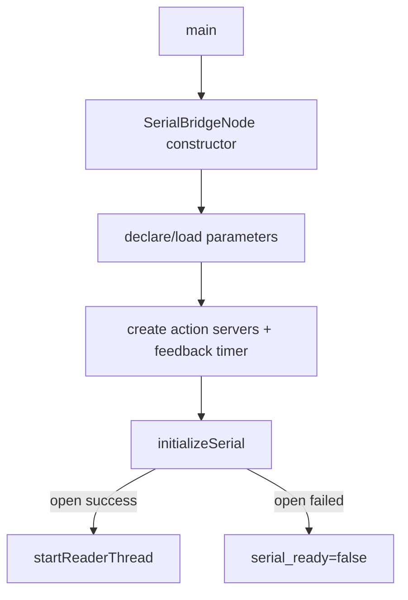
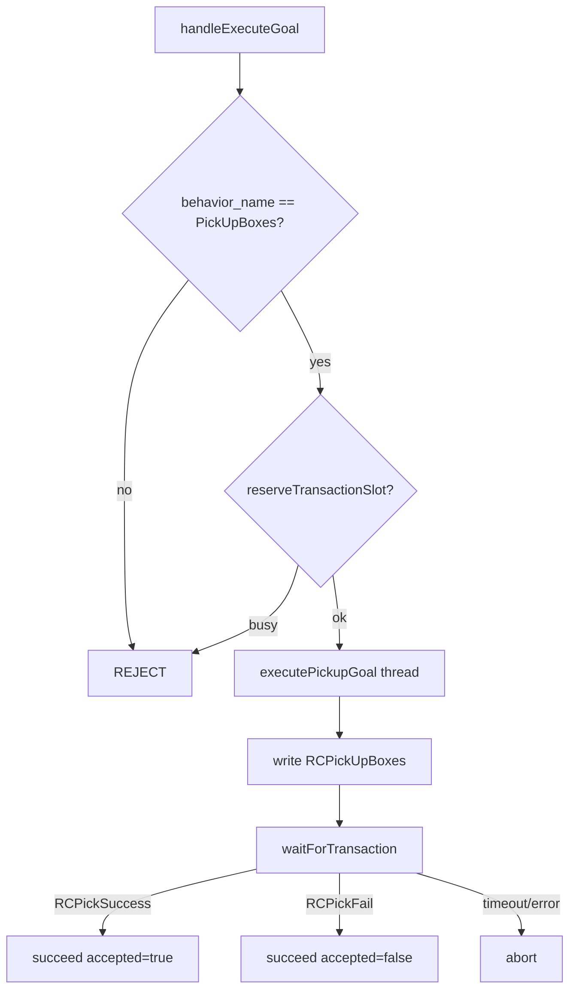
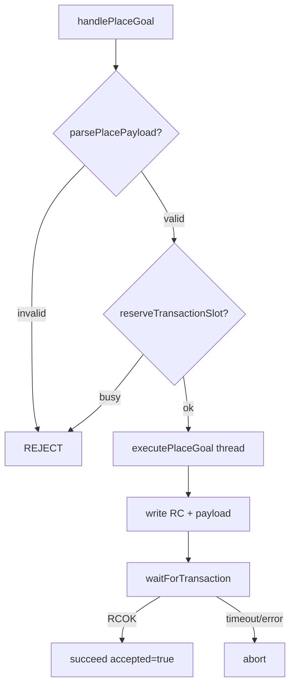

# dog_serial_bridge AI 开发查询文档

本文档面向 AI 辅助开发与代码检索，聚焦以下目标：

1. 快速理解串口服务层在系统中的位置。
2. 明确 ROS Action、Topic 与下位机串口协议的映射关系。
3. 提供可直接跳转的源码锚点，便于影响分析、回归设计与后续迭代。

适用范围：`src/dog_serial_bridge` 包。

---

## 1. 包定位与组成

包路径：[src/dog_serial_bridge](../src/dog_serial_bridge)

`dog_serial_bridge` 是 `dog_behavior` 与下位机 MCU 串口协议之间的桥接层。它包含两类独立串口链路：

1. 命令事务链路：保持上层行为包已使用的 Action 接口不变，将抓取/放置请求转换为 `RC...` 串口帧，并把下位机回包转换为 Action result。
2. 目标点导航链路：独立串口接收 `/behavior/nav_execute` Action goal，将目标位姿转换为 `RCNAV...` 串口帧，并等待 MCU 固定回包 `RCArrivalMX` 确认到达。

核心文件：

1. 节点头文件：[src/dog_serial_bridge/include/dog_serial_bridge/serial_bridge_node.hpp](../src/dog_serial_bridge/include/dog_serial_bridge/serial_bridge_node.hpp)
2. 节点实现：[src/dog_serial_bridge/src/serial_bridge_node.cpp](../src/dog_serial_bridge/src/serial_bridge_node.cpp)
3. 串口抽象接口：[src/dog_serial_bridge/include/dog_serial_bridge/serial_connection.hpp](../src/dog_serial_bridge/include/dog_serial_bridge/serial_connection.hpp)
4. 系统串口实现头文件：[src/dog_serial_bridge/include/dog_serial_bridge/system_serial_connection.hpp](../src/dog_serial_bridge/include/dog_serial_bridge/system_serial_connection.hpp)
5. 系统串口实现：[src/dog_serial_bridge/src/system_serial_connection.cpp](../src/dog_serial_bridge/src/system_serial_connection.cpp)
6. 协议工具头文件：[src/dog_serial_bridge/include/dog_serial_bridge/serial_protocol.hpp](../src/dog_serial_bridge/include/dog_serial_bridge/serial_protocol.hpp)
7. 协议工具实现：[src/dog_serial_bridge/src/serial_protocol.cpp](../src/dog_serial_bridge/src/serial_protocol.cpp)
8. 命令事务节点入口：[src/dog_serial_bridge/src/main.cpp](../src/dog_serial_bridge/src/main.cpp)
9. 目标点导航节点头文件（历史命名为 nav telemetry）：[src/dog_serial_bridge/include/dog_serial_bridge/nav_telemetry_serial_node.hpp](../src/dog_serial_bridge/include/dog_serial_bridge/nav_telemetry_serial_node.hpp)
10. 目标点导航节点实现：[src/dog_serial_bridge/src/nav_telemetry_serial_node.cpp](../src/dog_serial_bridge/src/nav_telemetry_serial_node.cpp)
11. 目标点导航节点入口：[src/dog_serial_bridge/src/nav_telemetry_main.cpp](../src/dog_serial_bridge/src/nav_telemetry_main.cpp)

构建入口：

1. [src/dog_serial_bridge/CMakeLists.txt](../src/dog_serial_bridge/CMakeLists.txt)
2. [src/dog_serial_bridge/package.xml](../src/dog_serial_bridge/package.xml)

测试：

1. 协议单元测试：[src/dog_serial_bridge/test/test_serial_protocol.cpp](../src/dog_serial_bridge/test/test_serial_protocol.cpp)
2. Action 桥接集成测试：[src/dog_serial_bridge/test/test_serial_bridge_node.cpp](../src/dog_serial_bridge/test/test_serial_bridge_node.cpp)
3. 目标点导航串口测试：[src/dog_serial_bridge/test/test_nav_telemetry_serial_node.cpp](../src/dog_serial_bridge/test/test_nav_telemetry_serial_node.cpp)

---

## 2. 运行时职责概览

`SerialBridgeNode` 在运行时承担两条主线：

1. 抓取动作桥接：接收 `/behavior/execute` 的 `PickUpBoxes` goal，发送 `RCPickUpBoxes`，等待抓取成功或失败回包。
2. 放置动作桥接：接收 `/behavior/place_boxes` 的 `place=...,count=...` payload，发送 `RC` + payload，等待 `RCOK` 回包。

`NavTelemetrySerialNode` 在运行时承担一条独立目标点导航链路：

1. 提供 `/behavior/nav_execute` Action Server，类型为 `dog_interfaces/action/NavigateWaypoint`。
2. 订阅 `/dog/global_pose` 获取当前位置，用于填充 `RCNAV` 帧中的 `cur_*` 字段。
3. 收到导航目标后发布 `/behavior/nav_goal`，供观测与兼容已有调试链路。
4. 通过独立串口发送一次 `RCNAV` 目标帧，等待 MCU 返回固定字符串 `RCArrivalMX` 后完成 Action。

数据主链路：

```mermaid
flowchart TD
  A[dog_behavior BT Action Client] --> B[/behavior/execute]
  C[dog_behavior BT Action Client] --> D[/behavior/place_boxes]
  B --> E[SerialBridgeNode]
  D --> E
  E --> F[SerialConnection]
  F --> G[MCU Serial Protocol]
  G --> F
  F --> E
  E --> H[Action Result]
  K[dog_behavior BT Action Client] --> L[/behavior/nav_execute]
  M[/dog/global_pose] --> N[NavTelemetrySerialNode]
  L --> N
  N --> O[/behavior/nav_goal]
  N --> P[Navigation SerialConnection]
  P --> Q[MCU Navigation Parser]
  Q --> P
  P --> N
  N --> R[Action Result]
```

---

## 3. 外部接口

### 3.1 Action Server

`SerialBridgeNode` 提供两个 Action Server：

1. `/behavior/execute`：类型为 [dog_interfaces/action/ExecuteBehavior.action](../src/dog_interfaces/action/ExecuteBehavior.action)
2. `/behavior/place_boxes`：类型为 [dog_interfaces/action/PlaceBoxes.action](../src/dog_interfaces/action/PlaceBoxes.action)

`NavTelemetrySerialNode` 提供一个 Action Server：

1. `/behavior/nav_execute`：类型为 [dog_interfaces/action/NavigateWaypoint.action](../src/dog_interfaces/action/NavigateWaypoint.action)

关键约束：

1. `/behavior/execute` 当前仅接受 `behavior_name=PickUpBoxes`。
2. `/behavior/place_boxes` 当前仅接受 `payload` 符合 `place=...,count=...` 的请求。
3. `SerialBridgeNode` 为单串口、单事务模型，同一时刻只允许一个 in-flight command；忙时新 goal 直接 `REJECT`。
4. `NavTelemetrySerialNode` 独立使用导航串口，同一时刻只允许一个 in-flight navigation goal；忙时新 goal 直接 `REJECT`。

### 3.2 Topic Publisher

`NavTelemetrySerialNode` 发布：

1. `/behavior/nav_goal`：类型为 `geometry_msgs/msg/PoseStamped`
2. 内容为当前 `/behavior/nav_execute` goal 中的目标位姿，供观测、串口联调和上位机调试使用。

### 3.3 Topic Subscriber

`NavTelemetrySerialNode` 订阅：

1. `/dog/global_pose`：类型为 `geometry_msgs/msg/PoseStamped`，来自 `dog_behavior` 当前全局位姿发布。

注意：`/behavior/nav_exec_state` 由 `dog_behavior::bt_nodes::NavigateWaypointAction` 发布，不由 `dog_serial_bridge` 发布。

### 3.4 ROS 参数

`SerialBridgeNode` 参数声明入口：[src/dog_serial_bridge/src/serial_bridge_node.cpp#L78](../src/dog_serial_bridge/src/serial_bridge_node.cpp#L78)

| 参数 | 默认值 | 作用 |
| --- | --- | --- |
| `serial_port` | `/dev/ttyUSB0` | Linux 串口设备路径 |
| `baud_rate` | `115200` | 串口波特率 |
| `ack_timeout_ms` | `1500` | 等待 MCU ack/result 的超时时间 |
| `feedback_period_ms` | `200` | Action feedback 心跳周期 |
| `write_newline` | `true` | 写串口帧时是否追加 `\n` |
| `read_line_delimiter` | `\\n` | 读串口回包的行分隔符 |

`NavTelemetrySerialNode` 参数声明入口：[src/dog_serial_bridge/src/nav_telemetry_serial_node.cpp](../src/dog_serial_bridge/src/nav_telemetry_serial_node.cpp)

| 参数 | 默认值 | 作用 |
| --- | --- | --- |
| `serial_port` | `/dev/ttyUSB1` | 目标点导航串口设备路径 |
| `baud_rate` | `115200` | 目标点导航串口波特率 |
| `ack_timeout_ms` | `10000` | 等待 `RCArrivalMX` 到达回包的超时时间 |
| `reconnect_period_ms` | `1000` | 串口打开或写入失败后的重连间隔 |
| `write_newline` | `true` | 写串口帧时是否追加 `\n` |
| `read_line_delimiter` | `\\n` | 读取 MCU 回包的行分隔符 |
| `current_pose_topic` | `/dog/global_pose` | 当前位置订阅 topic |
| `goal_pose_topic` | `/behavior/nav_goal` | 当前目标发布 topic |
| `action_name` | `/behavior/nav_execute` | 目标点导航 Action 名 |

launch 入口由 `dog_behavior/launch/launch.py` 提供，可选启用：

```bash
ros2 launch dog_behavior launch.py use_nav_telemetry_serial:=true nav_telemetry_serial_port:=/dev/ttyUSB1 nav_telemetry_ack_timeout_ms:=10000
```

导航/串口/PointLIO 测试模式会跳过抓取/放置串口桥，但保留目标点导航串口闭环：

```bash
ros2 launch dog_behavior launch.py test_mode:=true use_livox:=true livox_model:=mid360 use_point_lio:=true use_nav_telemetry_serial:=true nav_telemetry_serial_port:=/dev/ttyUSB1
```

测试模式约束：

1. `dog_serial_bridge_node` 不启动，即 `/behavior/execute` 与 `/behavior/place_boxes` 不由串口桥提供。
2. `dog_serial_bridge_nav_telemetry_node` 仍按 `use_nav_telemetry_serial:=true` 启动，`/behavior/nav_execute` 仍发送 `RCNAV` 并等待 `RCArrivalMX`。
3. 抓取/放置动作由 `dog_behavior` 的 `AutoSuccessAction` 在 BT 内部直接成功，不等待 MCU 抓放回包。
4. CH340 设备通常枚举为 `/dev/ttyUSB*`，驱动为 `ch341`，用户需具备 `dialout` 组权限或临时调整设备权限。

---

## 4. 串口协议映射

协议常量定义：[src/dog_serial_bridge/include/dog_serial_bridge/serial_protocol.hpp](../src/dog_serial_bridge/include/dog_serial_bridge/serial_protocol.hpp)

### 4.0.1 字符串协议分层

本包同时涉及两类字符串格式，不能混用：

1. ROS 节点间通用 payload：多数字段使用分号分隔 `key=value;key=value`，由 `dog_behavior::utils::parseKeyValuePayload()` 解析。
2. `PlaceBoxes.goal.payload`：当前格式为 `place=0,3,count=3`，由 `dog_serial_bridge::parsePlacePayload()` 解析，不是分号协议。

### 4.0 标准帧格式

当前串口协议采用一行一帧的 ASCII 文本格式：

```text
<开始帧/命令前缀><payload><结束帧>
```

字段约定：

| 部分 | 当前约定 | 说明 |
| --- | --- | --- |
| 开始帧/命令前缀 | `RC` | 所有发往 MCU 的业务帧均以 `RC` 开头 |
| payload | 业务字段 | 抓取、放置、目标点导航各自定义 |
| 结束帧 | `\n` | 默认由 `write_newline=true` 追加，MCU 可按换行切包 |

标准示例：

```text
RCPickUpBoxes\n
RCplace=0,3,count=3\n
RCNAV;seq=1;stamp_ms=1710000000123;cur_valid=1;cur_frame=map;cur_x=123.000;cur_y=42.000;cur_z=0.000;cur_yaw=0.000;goal_valid=1;goal_frame=map;goal_x=300.000;goal_y=200.000;goal_z=0.000;goal_yaw=0.000\n
RCArrivalMX\n
```

注意：

1. 文档中的 `\n` 表示单个换行字节，不是两个字符反斜杠和 n。
2. 如果 `write_newline=false`，节点不会自动追加结束帧；实际联调建议保持默认 `true`。
3. `read_line_delimiter` 用于读取 MCU 回包；目标点导航节点等待固定回包 `RCArrivalMX`。

### 4.1 抓取命令

上层请求：

```text
/behavior/execute goal.behavior_name = PickUpBoxes
```

串口发送：

```text
RCPickUpBoxes\n
```

回包映射：

| MCU 回包 | Action 状态 | Result 字段 |
| --- | --- | --- |
| `RCPickSuccess` | `succeed` | `accepted=true`, `detail=pick_success` |
| `RCPickFail` | `succeed` | `accepted=false`, `detail=pick_fail` |
| 超时 | `abort` | `accepted=false`, `detail=ack_timeout` |
| 串口错误 | `abort` | `accepted=false`, `detail=serial_*` |

Action feedback 心跳：

```text
progress = 0.5
state = waiting_pick_result
```

注意：`RCPickFail` 的 ROS action code 仍为 `SUCCEEDED`，业务失败通过 Result 的 `accepted=false` 表达；上游 BT 叶子会把 `accepted=false` 当作失败。

### 4.2 放置命令

上层请求示例：

```text
/behavior/place_boxes goal.payload = place=0,3,count=3
```

串口发送：

```text
RCplace=0,3,count=3\n
```

回包映射：

| MCU 回包 | Action 状态 | Result 字段 |
| --- | --- | --- |
| `RCOK` | `succeed` | `accepted=true`, `detail=place_ok` |
| 超时 | `abort` | `accepted=false`, `detail=ack_timeout` |
| 串口错误 | `abort` | `accepted=false`, `detail=serial_*` |

Action feedback 心跳：

```text
progress = 0.5
state = waiting_place_ack
```

### 4.3 目标点导航命令

上层请求：

```text
/behavior/nav_execute goal.target_pose = geometry_msgs/msg/PoseStamped
```

辅助输入/输出：

```text
/dog/global_pose        geometry_msgs/msg/PoseStamped   # 输入，用于 cur_* 字段
/behavior/nav_goal      geometry_msgs/msg/PoseStamped   # 输出，发布当前目标位姿
```

注意：`/behavior/nav_goal` 也会由 `dog_behavior::bt_nodes::NavigateWaypointAction` 在发送 action goal 前发布；`NavTelemetrySerialNode` 收到 goal 后会再次发布。`/behavior/nav_exec_state` 不由本节点发布。

串口发送：

```text
RCNAV;seq=1;stamp_ms=1710000000123;cur_valid=1;cur_frame=map;cur_x=123.000;cur_y=42.000;cur_z=0.000;cur_yaw=0.000;goal_valid=1;goal_frame=map;goal_x=300.000;goal_y=200.000;goal_z=0.000;goal_yaw=0.000\n
```

字段说明：

| 字段 | 说明 |
| --- | --- |
| `seq` | 节点本地递增序号 |
| `stamp_ms` | ROS 当前时间毫秒 |
| `cur_valid` | 是否已有合法当前位置 |
| `cur_frame` | 当前位置 frame id，非法字符会替换为 `_` |
| `cur_x/cur_y/cur_z` | 当前三维位置，串口发送单位为厘米；ROS 内部 `PoseStamped` 仍为米，发送前乘以 100 |
| `cur_yaw` | 当前 yaw，单位角度；ROS 内部四元数反解后由弧度转换为角度发送 |
| `goal_valid` | 是否已有合法导航目标 |
| `goal_frame` | 目标 frame id，非法字符会替换为 `_` |
| `goal_x/goal_y/goal_z` | 目标三维位置，串口发送单位为厘米；ROS 内部 `PoseStamped` 仍为米，发送前乘以 100 |
| `goal_yaw` | 目标 yaw，单位角度；ROS 内部四元数反解后由弧度转换为角度发送 |

回包映射：

| MCU 回包 | Action 状态 | Result 字段 |
| --- | --- | --- |
| `RCArrivalMX` | `succeed` | `accepted=true`, `detail=arrival_ok` |
| 超时 | `abort` | `accepted=false`, `detail=arrival_timeout` |
| 串口未就绪 | `abort` | `accepted=false`, `detail=serial_not_ready` |
| 串口读写错误 | `abort` | `accepted=false`, `detail=serial_*` |

Action feedback：

```text
progress = 0.1
state = sending_goal

progress = 0.5
state = waiting_arrival
```

约束：

1. 每个 Action goal 只发送一次 `RCNAV` 目标帧，不再按周期连续发送。
2. `RCArrivalMX` 是固定完成字符串，不解析 `X` 或坐标匹配关系。
3. 未收到当前位置时 `cur_valid=0`，对应坐标填 `0.000`，frame 填 `unknown`。
4. 目标位姿必须是有限数值且四元数范数合法，否则 Action goal 直接 `REJECT`。
5. `RCNAV` 帧不包含 `state`、`goal_active` 或 `/behavior/nav_exec_state` 数据；行为层状态由 `dog_behavior` 的 BT 叶子发布。
6. `test_mode:=true` 不改变目标点导航串口协议；它只绕过抓取/放置串口链路。
7. 下位机烧录测试固件时，可能只返回数字或逗号分隔测试数据；节点会记录 `nav_telemetry_serial_rx`，但只有收到完整 `RCArrivalMX` 才会将 Action 判定为到达成功。

实机验证要点：

1. 日志出现 `nav_telemetry_serial_ready port=/dev/ttyUSB0 baud=115200` 表示 CH340 串口已打开。
2. 日志出现 `nav_telemetry_serial_tx ... RCNAV;...` 表示上位机已向下位机发送目标点帧。
3. 日志出现 `nav_telemetry_serial_rx ...` 表示已收到下位机回传，通讯层已打通。
4. 非 `RCArrivalMX` 回包会产生 `nav_serial_line_unmatched`，随后可能因 `ack_timeout_ms` 到达而返回 `arrival_timeout`；在测试固件场景下这是协议层预期结果，不等同于 USB/串口通讯失败。

---

## 5. 函数调用结构（可检索）

### 5.1 节点启动链

入口链路：

1. main 创建 `SerialBridgeNode` 并 spin：[src/dog_serial_bridge/src/main.cpp#L7](../src/dog_serial_bridge/src/main.cpp#L7)
2. 构造函数声明并读取参数：[src/dog_serial_bridge/src/serial_bridge_node.cpp#L25](../src/dog_serial_bridge/src/serial_bridge_node.cpp#L25)
3. 创建 `/behavior/execute` Action Server：[src/dog_serial_bridge/src/serial_bridge_node.cpp](../src/dog_serial_bridge/src/serial_bridge_node.cpp)
4. 创建 `/behavior/place_boxes` Action Server：[src/dog_serial_bridge/src/serial_bridge_node.cpp](../src/dog_serial_bridge/src/serial_bridge_node.cpp)
5. 创建周期 feedback timer：[src/dog_serial_bridge/src/serial_bridge_node.cpp](../src/dog_serial_bridge/src/serial_bridge_node.cpp)
6. 打开串口并启动 reader thread：[src/dog_serial_bridge/src/serial_bridge_node.cpp](../src/dog_serial_bridge/src/serial_bridge_node.cpp)

目标点导航入口链路：

1. main 创建 `NavTelemetrySerialNode` 并 spin：[src/dog_serial_bridge/src/nav_telemetry_main.cpp](../src/dog_serial_bridge/src/nav_telemetry_main.cpp)
2. 构造函数声明并读取参数：[src/dog_serial_bridge/src/nav_telemetry_serial_node.cpp](../src/dog_serial_bridge/src/nav_telemetry_serial_node.cpp)
3. 创建 `/dog/global_pose` subscriber 与 `/behavior/nav_goal` publisher。
4. 打开独立串口。
5. 创建 `/behavior/nav_execute` Action Server。



### 5.2 抓取 Action 链

关键入口：

1. goal 校验与 busy 保护：[src/dog_serial_bridge/src/serial_bridge_node.cpp#L270](../src/dog_serial_bridge/src/serial_bridge_node.cpp#L270)
2. accepted 后起独立线程执行：[src/dog_serial_bridge/src/serial_bridge_node.cpp#L335](../src/dog_serial_bridge/src/serial_bridge_node.cpp#L335)
3. 开始抓取事务并记录 `pickup_sequence`：[src/dog_serial_bridge/src/serial_bridge_node.cpp#L348](../src/dog_serial_bridge/src/serial_bridge_node.cpp#L348)
4. 写入 `RCPickUpBoxes` 串口帧：[src/dog_serial_bridge/src/serial_bridge_node.cpp#L370](../src/dog_serial_bridge/src/serial_bridge_node.cpp#L370)
5. 等待事务结果：[src/dog_serial_bridge/src/serial_bridge_node.cpp#L384](../src/dog_serial_bridge/src/serial_bridge_node.cpp#L384)
6. 成功/空抓时完成 Action：[src/dog_serial_bridge/src/serial_bridge_node.cpp](../src/dog_serial_bridge/src/serial_bridge_node.cpp)



### 5.3 放置 Action 链

关键入口：

1. payload 校验与 busy 保护：[src/dog_serial_bridge/src/serial_bridge_node.cpp#L286](../src/dog_serial_bridge/src/serial_bridge_node.cpp#L286)
2. accepted 后起独立线程执行：[src/dog_serial_bridge/src/serial_bridge_node.cpp#L341](../src/dog_serial_bridge/src/serial_bridge_node.cpp#L341)
3. 开始放置事务：[src/dog_serial_bridge/src/serial_bridge_node.cpp#L423](../src/dog_serial_bridge/src/serial_bridge_node.cpp#L423)
4. 写入 `RC` + payload 串口帧：[src/dog_serial_bridge/src/serial_bridge_node.cpp#L446](../src/dog_serial_bridge/src/serial_bridge_node.cpp#L446)
5. 等待 `RCOK`：[src/dog_serial_bridge/src/serial_bridge_node.cpp#L460](../src/dog_serial_bridge/src/serial_bridge_node.cpp#L460)



### 5.4 串口读线程与事务分发链

关键入口：

1. reader thread 主循环：[src/dog_serial_bridge/src/serial_bridge_node.cpp#L164](../src/dog_serial_bridge/src/serial_bridge_node.cpp#L164)
2. 串口行分发：[src/dog_serial_bridge/src/serial_bridge_node.cpp#L197](../src/dog_serial_bridge/src/serial_bridge_node.cpp#L197)
3. 事务等待与超时：[src/dog_serial_bridge/src/serial_bridge_node.cpp#L541](../src/dog_serial_bridge/src/serial_bridge_node.cpp#L541)
4. 周期 Action feedback：[src/dog_serial_bridge/src/serial_bridge_node.cpp#L592](../src/dog_serial_bridge/src/serial_bridge_node.cpp#L592)

事务规则：

1. `reserveTransactionSlot()` 在 goal 阶段抢占单事务槽位，避免并发 goal 同时接受。
2. `beginPickupTransaction()` / `beginPlaceTransaction()` 写入 active transaction、deadline 与 feedback state。
3. `dispatchSerialLine()` 只匹配当前事务期望的回包；无关回包仅告警并忽略。
4. `waitForTransaction()` 使用 condition variable 等待回包、取消、串口错误或 deadline 超时。
5. `clearActiveTransactionLocked()` 在事务结束后释放 active transaction。

### 5.5 目标点导航 Action 链

关键入口：

1. 当前位置缓存：[src/dog_serial_bridge/src/nav_telemetry_serial_node.cpp](../src/dog_serial_bridge/src/nav_telemetry_serial_node.cpp) 的 `currentPoseCallback()`
2. goal 校验与 busy 保护：[src/dog_serial_bridge/src/nav_telemetry_serial_node.cpp](../src/dog_serial_bridge/src/nav_telemetry_serial_node.cpp) 的 `handleGoal()`
3. accepted 后起独立线程执行：[src/dog_serial_bridge/src/nav_telemetry_serial_node.cpp](../src/dog_serial_bridge/src/nav_telemetry_serial_node.cpp) 的 `handleAccepted()`
4. 发布 `/behavior/nav_goal`、组帧并写串口：[src/dog_serial_bridge/src/nav_telemetry_serial_node.cpp](../src/dog_serial_bridge/src/nav_telemetry_serial_node.cpp) 的 `executeGoal()`
5. 等待 `RCArrivalMX`：[src/dog_serial_bridge/src/nav_telemetry_serial_node.cpp](../src/dog_serial_bridge/src/nav_telemetry_serial_node.cpp) 的 `waitForArrival()`
6. 串口重连：[src/dog_serial_bridge/src/nav_telemetry_serial_node.cpp](../src/dog_serial_bridge/src/nav_telemetry_serial_node.cpp) 的 `maybeReconnect()`

```mermaid
flowchart TD
  A[/dog/global_pose] --> B[currentPoseCallback]
  C[/behavior/nav_execute] --> D[handleGoal]
  D -->|invalid/busy| E[REJECT]
  D -->|accepted| F[executeGoal thread]
  F --> G[publish /behavior/nav_goal]
  F --> H{serial ready?}
  H -->|no| I[maybeReconnect]
  H -->|yes| J[build RCNAV frame]
  I --> J
  J --> K[write serial]
  K -->|write failed| L[abort serial_write_error]
  K -->|ok| M[waitForArrival]
  M -->|RCArrivalMX| N[succeed accepted=true]
  M -->|timeout/error| O[abort]
```

目标点导航链路直接在 Action 执行线程中读取导航串口回包；它不修改 `SerialBridgeNode` 的 active transaction。

---

## 6. 串口访问抽象

### 6.1 SerialConnection

接口定义：[src/dog_serial_bridge/include/dog_serial_bridge/serial_connection.hpp](../src/dog_serial_bridge/include/dog_serial_bridge/serial_connection.hpp)

职责：

1. 抽象真实串口和测试 fake 串口。
2. 提供 `open()`、`isOpen()`、`close()`、`write()`、`readLine()`。
3. `readLine()` 返回 `kLine`、`kTimeout`、`kClosed` 或 `kError`。

测试中通过 `FakeSerialConnection` 注入 `SerialBridgeNode` 和 `NavTelemetrySerialNode`，避免依赖真实硬件。

### 6.2 SystemSerialConnection

实现入口：[src/dog_serial_bridge/src/system_serial_connection.cpp](../src/dog_serial_bridge/src/system_serial_connection.cpp)

Linux 实现要点：

1. 使用 `open(O_RDWR | O_NOCTTY | O_NONBLOCK)` 打开设备。
2. 使用 `termios` 配置 raw mode、8N1、禁用流控。
3. 当前支持波特率：`9600`、`19200`、`38400`、`57600`、`115200`。
4. `readLine()` 使用 `poll()` 等待可读，并按配置 delimiter 缓冲切行。
5. Windows 分支当前返回 `serial_unsupported_on_this_platform`，用于避免非 Linux 构建直接访问 termios。

---

## 7. 协议工具函数

实现入口：[src/dog_serial_bridge/src/serial_protocol.cpp](../src/dog_serial_bridge/src/serial_protocol.cpp)

| 函数 | 职责 |
| --- | --- |
| `buildPickupCommand()` | 返回 `RCPickUpBoxes` |
| `buildPlaceCommand(payload)` | 返回 `RC` + payload |
| `parsePlacePayload(payload, parsed, error_detail)` | 校验 `place=...,count=...` 并解析 count |
| `classifyReply(line)` | 将 `RCPickSuccess`、`RCPickFail`、`RCOK` 分类 |
| `buildPickupFeedback(sequence, success)` | 生成 `pickup_<seq>|success` 或 `pickup_<seq>|empty_grasp` |

payload 校验错误码：

1. `payload_missing_place`
2. `payload_missing_count`
3. `payload_invalid_place`
4. `payload_invalid_count`

---

## 8. 构建与测试

已验证命令：

```bash
source /opt/ros/humble/setup.bash
source install/setup.bash
colcon build --packages-select dog_interfaces dog_serial_bridge dog_behavior
colcon test --packages-select dog_serial_bridge dog_behavior
colcon test-result --all --verbose
```

当前测试覆盖：

1. `test_serial_protocol`：8 个协议单元测试。
2. `test_serial_bridge_node`：10 个 Action 桥接测试。
3. `test_nav_telemetry_serial_node`：3 个目标点导航串口测试。
4. 覆盖抓取成功、空抓、超时、busy reject、unsupported reject、serial_not_ready abort。
5. 覆盖放置成功、超时、busy reject、非法 payload reject、无关回包忽略。
6. 覆盖 Action feedback 心跳。
7. 覆盖目标点导航帧包含 current/goal pose、收到 `RCArrivalMX` 成功、超时失败、串口未就绪失败。
8. 已完成 CH340 `/dev/ttyUSB0` 实机收发验证：行为树测试程序发送 `RCNAV`，下位机测试固件有串口回传；正式到达成功仍依赖 MCU 返回 `RCArrivalMX`。

CMake 测试注意事项：

1. `test_serial_bridge_node` 和 `test_nav_telemetry_serial_node` 使用 ROS 2 日志。
2. 为避免当前环境中用户 home 下 `.ros/log` 不可写，CMake 已为相关测试设置 `ROS_LOG_DIR=${CMAKE_CURRENT_BINARY_DIR}/ros_log`。

---

## 9. AI 修改提示

后续 AI 修改该包时建议遵守以下规则：

1. 保持 `/behavior/execute`、`/behavior/place_boxes` Action 接口不变，避免破坏 `dog_behavior` 行为树叶子节点。
2. 修改串口协议时，先更新 `serial_protocol.*` 与 `test_serial_protocol.cpp`，再更新 `SerialBridgeNode` 分发逻辑。
3. 修改并发/超时逻辑时，重点检查 `reserveTransactionSlot()`、`begin*Transaction()`、`waitForTransaction()` 与 `feedbackTimerCallback()`。
4. 修改真实串口实现时，保留 `SerialConnection` 抽象，确保测试仍可用 fake 串口无硬件运行。
5. 增加新 MCU 回包时，必须明确其只对哪类 transaction 生效，避免不同 Action 互相误消费回包。
6. 目标点导航链路应保持独立串口和单 goal 执行模型；不要把导航回包混入 `SerialBridgeNode` 的抓取/放置事务。
7. `/behavior/nav_goal` 是观测 topic，`NavigateWaypointAction` 与 `NavTelemetrySerialNode` 都会发布；真正执行入口是 `/behavior/nav_execute` Action，不要依赖 ROS action hidden topic。

---

## 10. 已知边界与剩余风险

1. 当前在 ROS 2 Humble 下完成构建、fake 串口测试，并完成 CH340 `/dev/ttyUSB0` 目标点导航串口实机收发验证。
2. 下位机测试固件已验证通讯链路；完整导航 Action 成功语义仍要求正式固件按协议返回 `RCArrivalMX`。
3. 当前单串口单事务模型会拒绝并发 goal；如果未来需要队列化，需要重新设计事务队列与取消语义。
4. 当前 `SystemSerialConnection` 支持的波特率有限；新增波特率需要扩展 `toBaudRate()`。
5. Windows 分支不提供真实串口访问，仅用于非 Linux 平台构建安全降级。
6. 目标点导航节点默认使用 `/dev/ttyUSB1`，需要现场确认与抓取/放置串口 `/dev/ttyUSB0` 不冲突。
7. 目标点导航完成判定当前只接受固定字符串 `RCArrivalMX`；如果 MCU 后续携带目标编号或错误码，需要扩展回包分类和测试。
