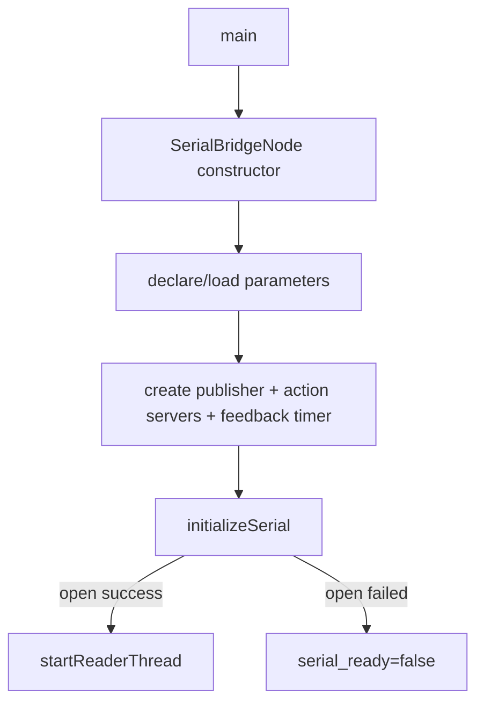
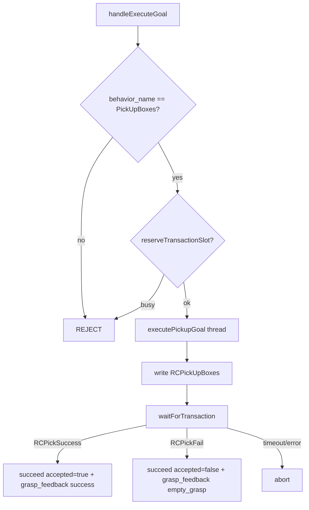
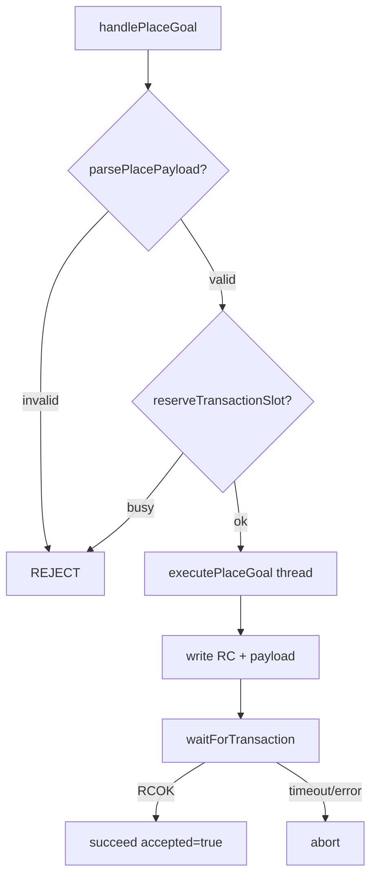

# dog_serial_bridge AI 开发查询文档

本文档面向 AI 辅助开发与代码检索，聚焦以下目标：

1. 快速理解串口服务层在系统中的位置。
2. 明确 ROS Action、Topic 与下位机串口协议的映射关系。
3. 提供可直接跳转的源码锚点，便于影响分析、回归设计与后续迭代。

适用范围：`src/dog_serial_bridge` 包。

---

## 1. 包定位与组成

包路径：[src/dog_serial_bridge](../src/dog_serial_bridge)

`dog_serial_bridge` 是 `dog_behavior` 与下位机 MCU 串口协议之间的桥接层。它保持上层行为包已使用的 Action 接口不变，同时将请求转换为 `RC...` 串口帧，并把下位机回包转换为 Action result 与 lifecycle 兼容抓取反馈。

核心文件：

1. 节点头文件：[src/dog_serial_bridge/include/dog_serial_bridge/serial_bridge_node.hpp](../src/dog_serial_bridge/include/dog_serial_bridge/serial_bridge_node.hpp)
2. 节点实现：[src/dog_serial_bridge/src/serial_bridge_node.cpp](../src/dog_serial_bridge/src/serial_bridge_node.cpp)
3. 串口抽象接口：[src/dog_serial_bridge/include/dog_serial_bridge/serial_connection.hpp](../src/dog_serial_bridge/include/dog_serial_bridge/serial_connection.hpp)
4. 系统串口实现头文件：[src/dog_serial_bridge/include/dog_serial_bridge/system_serial_connection.hpp](../src/dog_serial_bridge/include/dog_serial_bridge/system_serial_connection.hpp)
5. 系统串口实现：[src/dog_serial_bridge/src/system_serial_connection.cpp](../src/dog_serial_bridge/src/system_serial_connection.cpp)
6. 协议工具头文件：[src/dog_serial_bridge/include/dog_serial_bridge/serial_protocol.hpp](../src/dog_serial_bridge/include/dog_serial_bridge/serial_protocol.hpp)
7. 协议工具实现：[src/dog_serial_bridge/src/serial_protocol.cpp](../src/dog_serial_bridge/src/serial_protocol.cpp)
8. 进程入口：[src/dog_serial_bridge/src/main.cpp](../src/dog_serial_bridge/src/main.cpp)

构建入口：

1. [src/dog_serial_bridge/CMakeLists.txt](../src/dog_serial_bridge/CMakeLists.txt)
2. [src/dog_serial_bridge/package.xml](../src/dog_serial_bridge/package.xml)

测试：

1. 协议单元测试：[src/dog_serial_bridge/test/test_serial_protocol.cpp](../src/dog_serial_bridge/test/test_serial_protocol.cpp)
2. Action 桥接集成测试：[src/dog_serial_bridge/test/test_serial_bridge_node.cpp](../src/dog_serial_bridge/test/test_serial_bridge_node.cpp)

---

## 2. 运行时职责概览

`SerialBridgeNode` 在运行时承担三条主线：

1. 抓取动作桥接：接收 `/behavior/execute` 的 `PickUpBoxes` goal，发送 `RCPickUpBoxes`，等待抓取成功或失败回包。
2. 放置动作桥接：接收 `/behavior/place_boxes` 的 `place=...,count=...` payload，发送 `RC` + payload，等待 `RCOK` 回包。
3. lifecycle 兼容反馈：抓取成功或空抓时发布 `/behavior/grasp_feedback`，格式为 `pickup_<seq>|success` 或 `pickup_<seq>|empty_grasp`。

数据主链路：

```mermaid
flowchart TD
  A[dog_behavior BT Action Client] --> B[/behavior/execute]
  C[dog_behavior BT Action Client] --> D[/behavior/place_boxes]
  B --> E[SerialBridgeNode]
  D --> E
  E --> F[SerialConnection]
  F --> G[MCU Serial Protocol]
  G --> F
  F --> E
  E --> H[Action Result]
  E --> I[/behavior/grasp_feedback]
  I --> J[dog_lifecycle]
```

---

## 3. 外部接口

### 3.1 Action Server

`SerialBridgeNode` 提供两个 Action Server：

1. `/behavior/execute`：类型为 [dog_interfaces/action/ExecuteBehavior.action](../src/dog_interfaces/action/ExecuteBehavior.action)
2. `/behavior/place_boxes`：类型为 [dog_interfaces/action/PlaceBoxes.action](../src/dog_interfaces/action/PlaceBoxes.action)

关键约束：

1. `/behavior/execute` 当前仅接受 `behavior_name=PickUpBoxes`。
2. `/behavior/place_boxes` 当前仅接受 `payload` 符合 `place=...,count=...` 的请求。
3. 单串口、单事务模型，同一时刻只允许一个 in-flight command；忙时新 goal 直接 `REJECT`。

### 3.2 Topic Publisher

`SerialBridgeNode` 发布：

1. `/behavior/grasp_feedback`：类型为 `std_msgs/msg/String`
2. 成功抓取：`pickup_<seq>|success`
3. 空抓失败：`pickup_<seq>|empty_grasp`

该 topic 由 `dog_lifecycle` 消费，用于空抓熔断与生命周期降级逻辑。

### 3.3 ROS 参数

参数声明入口：[src/dog_serial_bridge/src/serial_bridge_node.cpp#L78](../src/dog_serial_bridge/src/serial_bridge_node.cpp#L78)

| 参数 | 默认值 | 作用 |
| --- | --- | --- |
| `serial_port` | `/dev/ttyUSB0` | Linux 串口设备路径 |
| `baud_rate` | `115200` | 串口波特率 |
| `ack_timeout_ms` | `1500` | 等待 MCU ack/result 的超时时间 |
| `feedback_period_ms` | `200` | Action feedback 心跳周期 |
| `write_newline` | `true` | 写串口帧时是否追加 `\n` |
| `read_line_delimiter` | `\\n` | 读串口回包的行分隔符 |

---

## 4. 串口协议映射

协议常量定义：[src/dog_serial_bridge/include/dog_serial_bridge/serial_protocol.hpp](../src/dog_serial_bridge/include/dog_serial_bridge/serial_protocol.hpp)

### 4.1 抓取命令

上层请求：

```text
/behavior/execute goal.behavior_name = PickUpBoxes
```

串口发送：

```text
RCPickUpBoxes
```

回包映射：

| MCU 回包 | Action 状态 | Result 字段 | lifecycle 反馈 |
| --- | --- | --- | --- |
| `RCPickSuccess` | `succeed` | `accepted=true`, `detail=pick_success` | `pickup_<seq>|success` |
| `RCPickFail` | `succeed` | `accepted=false`, `detail=pick_fail` | `pickup_<seq>|empty_grasp` |
| 超时 | `abort` | `accepted=false`, `detail=ack_timeout` | 不发布 |
| 串口错误 | `abort` | `accepted=false`, `detail=serial_*` | 不发布 |

Action feedback 心跳：

```text
progress = 0.5
state = waiting_pick_result
```

### 4.2 放置命令

上层请求示例：

```text
/behavior/place_boxes goal.payload = place=0,3,count=3
```

串口发送：

```text
RCplace=0,3,count=3
```

回包映射：

| MCU 回包 | Action 状态 | Result 字段 |
| --- | --- | --- |
| `RCOK` | `succeed` | `accepted=true`, `detail=place_ok` |
| 超时 | `abort` | `accepted=false`, `detail=ack_timeout` |
| 串口错误 | `abort` | `accepted=false`, `detail=serial_*` |

Action feedback 心跳：

```text
progress = 0.5
state = waiting_place_ack
```

---

## 5. 函数调用结构（可检索）

### 5.1 节点启动链

入口链路：

1. main 创建 `SerialBridgeNode` 并 spin：[src/dog_serial_bridge/src/main.cpp#L7](../src/dog_serial_bridge/src/main.cpp#L7)
2. 构造函数声明并读取参数：[src/dog_serial_bridge/src/serial_bridge_node.cpp#L25](../src/dog_serial_bridge/src/serial_bridge_node.cpp#L25)
3. 创建 `/behavior/grasp_feedback` publisher：[src/dog_serial_bridge/src/serial_bridge_node.cpp#L35](../src/dog_serial_bridge/src/serial_bridge_node.cpp#L35)
4. 创建 `/behavior/execute` Action Server：[src/dog_serial_bridge/src/serial_bridge_node.cpp#L45](../src/dog_serial_bridge/src/serial_bridge_node.cpp#L45)
5. 创建 `/behavior/place_boxes` Action Server：[src/dog_serial_bridge/src/serial_bridge_node.cpp#L52](../src/dog_serial_bridge/src/serial_bridge_node.cpp#L52)
6. 创建周期 feedback timer：[src/dog_serial_bridge/src/serial_bridge_node.cpp#L59](../src/dog_serial_bridge/src/serial_bridge_node.cpp#L59)
7. 打开串口并启动 reader thread：[src/dog_serial_bridge/src/serial_bridge_node.cpp#L115](../src/dog_serial_bridge/src/serial_bridge_node.cpp#L115)



### 5.2 抓取 Action 链

关键入口：

1. goal 校验与 busy 保护：[src/dog_serial_bridge/src/serial_bridge_node.cpp#L270](../src/dog_serial_bridge/src/serial_bridge_node.cpp#L270)
2. accepted 后起独立线程执行：[src/dog_serial_bridge/src/serial_bridge_node.cpp#L335](../src/dog_serial_bridge/src/serial_bridge_node.cpp#L335)
3. 开始抓取事务并记录 `pickup_sequence`：[src/dog_serial_bridge/src/serial_bridge_node.cpp#L348](../src/dog_serial_bridge/src/serial_bridge_node.cpp#L348)
4. 写入 `RCPickUpBoxes` 串口帧：[src/dog_serial_bridge/src/serial_bridge_node.cpp#L370](../src/dog_serial_bridge/src/serial_bridge_node.cpp#L370)
5. 等待事务结果：[src/dog_serial_bridge/src/serial_bridge_node.cpp#L384](../src/dog_serial_bridge/src/serial_bridge_node.cpp#L384)
6. 成功/空抓时发布 lifecycle 反馈并完成 Action：[src/dog_serial_bridge/src/serial_bridge_node.cpp#L385](../src/dog_serial_bridge/src/serial_bridge_node.cpp#L385)



### 5.3 放置 Action 链

关键入口：

1. payload 校验与 busy 保护：[src/dog_serial_bridge/src/serial_bridge_node.cpp#L286](../src/dog_serial_bridge/src/serial_bridge_node.cpp#L286)
2. accepted 后起独立线程执行：[src/dog_serial_bridge/src/serial_bridge_node.cpp#L341](../src/dog_serial_bridge/src/serial_bridge_node.cpp#L341)
3. 开始放置事务：[src/dog_serial_bridge/src/serial_bridge_node.cpp#L423](../src/dog_serial_bridge/src/serial_bridge_node.cpp#L423)
4. 写入 `RC` + payload 串口帧：[src/dog_serial_bridge/src/serial_bridge_node.cpp#L446](../src/dog_serial_bridge/src/serial_bridge_node.cpp#L446)
5. 等待 `RCOK`：[src/dog_serial_bridge/src/serial_bridge_node.cpp#L460](../src/dog_serial_bridge/src/serial_bridge_node.cpp#L460)



### 5.4 串口读线程与事务分发链

关键入口：

1. reader thread 主循环：[src/dog_serial_bridge/src/serial_bridge_node.cpp#L164](../src/dog_serial_bridge/src/serial_bridge_node.cpp#L164)
2. 串口行分发：[src/dog_serial_bridge/src/serial_bridge_node.cpp#L197](../src/dog_serial_bridge/src/serial_bridge_node.cpp#L197)
3. 事务等待与超时：[src/dog_serial_bridge/src/serial_bridge_node.cpp#L541](../src/dog_serial_bridge/src/serial_bridge_node.cpp#L541)
4. 周期 Action feedback：[src/dog_serial_bridge/src/serial_bridge_node.cpp#L592](../src/dog_serial_bridge/src/serial_bridge_node.cpp#L592)

事务规则：

1. `reserveTransactionSlot()` 在 goal 阶段抢占单事务槽位，避免并发 goal 同时接受。
2. `beginPickupTransaction()` / `beginPlaceTransaction()` 写入 active transaction、deadline 与 feedback state。
3. `dispatchSerialLine()` 只匹配当前事务期望的回包；无关回包仅告警并忽略。
4. `waitForTransaction()` 使用 condition variable 等待回包、取消、串口错误或 deadline 超时。
5. `clearActiveTransactionLocked()` 在事务结束后释放 active transaction。

---

## 6. 串口访问抽象

### 6.1 SerialConnection

接口定义：[src/dog_serial_bridge/include/dog_serial_bridge/serial_connection.hpp](../src/dog_serial_bridge/include/dog_serial_bridge/serial_connection.hpp)

职责：

1. 抽象真实串口和测试 fake 串口。
2. 提供 `open()`、`isOpen()`、`close()`、`write()`、`readLine()`。
3. `readLine()` 返回 `kLine`、`kTimeout`、`kClosed` 或 `kError`。

测试中通过 `FakeSerialConnection` 注入节点，避免依赖真实硬件。

### 6.2 SystemSerialConnection

实现入口：[src/dog_serial_bridge/src/system_serial_connection.cpp](../src/dog_serial_bridge/src/system_serial_connection.cpp)

Linux 实现要点：

1. 使用 `open(O_RDWR | O_NOCTTY | O_NONBLOCK)` 打开设备。
2. 使用 `termios` 配置 raw mode、8N1、禁用流控。
3. 当前支持波特率：`9600`、`19200`、`38400`、`57600`、`115200`。
4. `readLine()` 使用 `poll()` 等待可读，并按配置 delimiter 缓冲切行。
5. Windows 分支当前返回 `serial_unsupported_on_this_platform`，用于避免非 Linux 构建直接访问 termios。

---

## 7. 协议工具函数

实现入口：[src/dog_serial_bridge/src/serial_protocol.cpp](../src/dog_serial_bridge/src/serial_protocol.cpp)

| 函数 | 职责 |
| --- | --- |
| `buildPickupCommand()` | 返回 `RCPickUpBoxes` |
| `buildPlaceCommand(payload)` | 返回 `RC` + payload |
| `parsePlacePayload(payload, parsed, error_detail)` | 校验 `place=...,count=...` 并解析 count |
| `classifyReply(line)` | 将 `RCPickSuccess`、`RCPickFail`、`RCOK` 分类 |
| `buildPickupFeedback(sequence, success)` | 生成 `pickup_<seq>|success` 或 `pickup_<seq>|empty_grasp` |

payload 校验错误码：

1. `payload_missing_place`
2. `payload_missing_count`
3. `payload_invalid_place`
4. `payload_invalid_count`

---

## 8. 构建与测试

已验证命令：

```bash
colcon build --packages-select dog_serial_bridge dog_behavior dog_interfaces dog_lifecycle
colcon test --packages-select dog_serial_bridge --event-handlers console_direct+
colcon test-result --verbose
```

当前测试覆盖：

1. `test_serial_protocol`：8 个协议单元测试。
2. `test_serial_bridge_node`：10 个 Action 桥接测试。
3. 覆盖抓取成功、空抓、超时、busy reject、unsupported reject、serial_not_ready abort。
4. 覆盖放置成功、超时、busy reject、非法 payload reject、无关回包忽略。
5. 覆盖 Action feedback 心跳与 lifecycle grasp feedback 发布。

CMake 测试注意事项：

1. `test_serial_bridge_node` 使用 ROS 2 日志。
2. 为避免当前环境中 `/home/ywj/.ros/log` 不可写，CMake 已为该测试设置 `ROS_LOG_DIR=${CMAKE_CURRENT_BINARY_DIR}/ros_log`。

---

## 9. AI 修改提示

后续 AI 修改该包时建议遵守以下规则：

1. 保持 `/behavior/execute`、`/behavior/place_boxes` Action 接口不变，避免破坏 `dog_behavior` 行为树叶子节点。
2. 保持 `/behavior/grasp_feedback` 的 `task_id|type` 格式，避免破坏 `dog_lifecycle` 空抓熔断逻辑。
3. 修改串口协议时，先更新 `serial_protocol.*` 与 `test_serial_protocol.cpp`，再更新 `SerialBridgeNode` 分发逻辑。
4. 修改并发/超时逻辑时，重点检查 `reserveTransactionSlot()`、`begin*Transaction()`、`waitForTransaction()` 与 `feedbackTimerCallback()`。
5. 修改真实串口实现时，保留 `SerialConnection` 抽象，确保测试仍可用 fake 串口无硬件运行。
6. 增加新 MCU 回包时，必须明确其只对哪类 transaction 生效，避免不同 Action 互相误消费回包。

---

## 10. 已知边界与剩余风险

1. 当前仅在 ROS 2 Humble 下完成构建与 fake 串口测试。
2. 尚未接真实 MCU 串口设备做端到端硬件联调。
3. 当前单串口单事务模型会拒绝并发 goal；如果未来需要队列化，需要重新设计事务队列与取消语义。
4. 当前 `SystemSerialConnection` 支持的波特率有限；新增波特率需要扩展 `toBaudRate()`。
5. Windows 分支不提供真实串口访问，仅用于非 Linux 平台构建安全降级。
